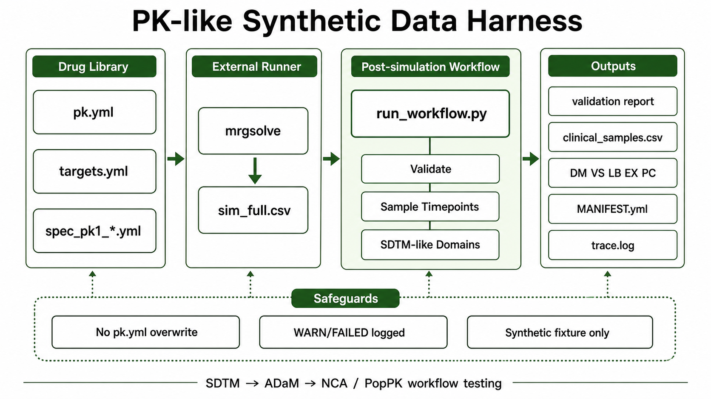
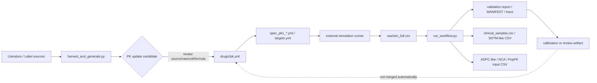

# OSP PK Codex Harness

このリポジトリは、文献由来のPK要約を使って **PK-like synthetic data** を作るための軽量ハーネスです。

主な目的は、臨床薬理モデルの妥当化ではなく、**SDTM -> ADaM -> NCA / PopPK 解析ワークフローを素早く回すための、実データ風ダミーデータ生成**です。



## Positioning

このハーネスは、薬剤ごとの文献スケールの `CL`, `V`, `t1/2`, `AUC` を使い、解析パイプライン検証に使いやすい synthetic fixture を作るためのものです。

| Perspective | What this harness provides |
| --- | --- |
| 臨床薬理 | 文献スケールのPK値をもつ1-compartment dummy profile |
| 統計 | 再現可能な入力、seed、検証結果、trace、manifest |
| プログラマー | `sim_full.csv` から下流データセットまでの決定論的な後処理 |
| Codex/agent | task, context, safeguards, logs を分離した作業しやすい構造 |

## Intended Use

使ってよい目的:

- SDTM/ADaM/NCA/PopPK パイプラインの開発と動作確認
- PK解析用CSV、NONMEM風データ、集計レポートの生成テスト
- 文献スケールの `CL/V/t1/2/AUC` を持つ synthetic fixture の作成
- 類似薬デモや解析コードの smoke test
- WARN/FAILED ケースを使った処理系の stress test

使うべきではない目的:

- 臨床推論、投与設計、曝露予測の根拠
- 規制提出用のモデル妥当化
- 薬剤固有の吸収相、IIV、残差誤差、VPC/GOF の代替
- 腎機能、共変量効果、非線形PK、TMDDなどの臨床的検証

## Quick Start

最短で動かす場合は [Quickstart](docs/QUICKSTART.md) を見てください。複数薬剤デモから `ADPC.csv`, `NCA_INPUT.csv`, `POPPK_INPUT.csv` まで確認できます。

まずリポジトリ整合性を確認します。

```bash
python3 -m pip install -r requirements.txt
make harness-check
```

薬剤一覧を見る:

```bash
column -s, -t < INDEX.csv | less -S
```

外部runnerで `sim_full.csv` を作成した後、後処理を一括で回します。

```bash
python3 tools/run_workflow.py \
  --sim-full outputs/<run>/raw/sim_full.csv \
  --drug <slug> \
  --times 0,0.5,1,2,4,8,12,24 \
  --out-dir outputs/<run>/workflow
```

このコマンドは以下をまとめて実行します。

```text
validate_simulation.py
-> sample_clinical_timepoints.py
-> make_sdtm_like_domains.py
-> make_analysis_inputs.py
-> MANIFEST.yml / trace.log 作成
```

ADPC-like出力から、被験者背景の記述統計、時点別濃度統計、ggplot2による濃度推移図を出す場合:

```bash
Rscript tools/report_pk_fixture.R \
  --analysis-dir outputs/<run>/workflow/analysis_inputs \
  --out-dir outputs/<run>/workflow/reports/pk_fixture_report \
  --title "<slug> PK fixture report"
```

このレポートはfixture確認用の記述統計です。臨床薬理モデルの妥当化やsubmission-ready ADaMレポートではありません。

Word共有用のdocxが必要な場合は、Quarto版を追加で作れます。

```bash
Rscript tools/render_pk_fixture_quarto.R \
  --analysis-dir outputs/<run>/workflow/analysis_inputs \
  --out-dir outputs/<run>/workflow/reports/pk_fixture_quarto \
  --title "<slug> PK fixture report"
```

このQuarto版は `templates/pk_fixture_report.qmd` を使い、同じ記述統計とggplot画像を `pk_fixture_report.docx` に変換します。Wordスタイルを指定したい場合は `--reference-doc reference.docx` を追加してください。

既存の `DM/LB/VS/PC` skeletonがない場合は、ハーネス側がSDTM-like CSVを生成します。既存の `DM/LB/VS` と濃度なし `PC` skeletonがある場合は、それらを渡して `PC` に濃度だけを注入できます。

複数薬剤デモをまとめて作る場合:

```bash
python3 tools/run_harness.py harness_examples/demo_set.yml
```

`run_harness.py` は設定ファイルから既存ツールを呼ぶ共通入口です。`harness_examples/demo_set.yml` は、外部mrgsolve runnerがない環境でもsmoke demoを作れるように、既存specのthetaからデモ専用の解析式 `sim_full.csv` を作り、その後 `run_workflow.py` を各薬剤で実行します。これは下流接続確認用であり、mrgsolve runnerの代替ではありません。

## Standard Workflow

### 1. Choose a drug

薬剤テンプレートは `drugs/<slug>/` にあります。

```text
drugs/<slug>/
  pk.yml              # source/raw/parsed/derived PK summary
  targets.yml         # AUC and t1/2 minimum check targets
  spec_pk1_*.yml      # runnable 1-compartment simulation spec
```

`INDEX.csv` で slug、route、半減期、CL/V、specの有無を確認できます。

### 2. Run an external simulation runner

このリポジトリは mrgsolve runner 本体を同梱していません。利用環境側のrunnerに `spec_pk1_*.yml` を渡してください。

```bash
Rscript <mrgsolve-runner> drugs/<slug>/spec_pk1_oral.yml
```

典型的な生成物:

```text
outputs/<run>/
  raw/sim_full.csv
  nonmem/*.csv
  reports/*.md
```

### 3. Run the post-simulation workflow

`sim_full.csv` ができたら、`run_workflow.py` が後処理の中心になります。

```bash
python3 tools/run_workflow.py \
  --sim-full outputs/<run>/raw/sim_full.csv \
  --drug <slug> \
  --times 0,0.5,1,2,4,8,12,24 \
  --out-dir outputs/<run>/workflow
```

既存試験の採血スケジュールに合わせる場合:

```bash
python3 tools/run_workflow.py \
  --sim-full outputs/<run>/raw/sim_full.csv \
  --drug <slug> \
  --schedule-csv schedule.csv \
  --out-dir outputs/<run>/workflow
```

`validate_simulation.py` が `FAILED` の場合、既定では `clinical_samples.csv` やSDTM-like CSVの生成に進みません。stress testとして続行したい場合だけ `--allow-validation-failed` を付けます。その場合も最終ステータスは `WARN` として記録されます。

### 4. Use existing SDTM-like skeletons when available

既存の `DM`, `VS`, `LB`, `PC` skeletonがある場合は、生成済みドメインをそのまま使い、`PC` の濃度だけをシミュレーション由来の `clinical_samples.csv` から埋められます。

```bash
python3 tools/run_workflow.py \
  --sim-full outputs/<run>/raw/sim_full.csv \
  --drug <slug> \
  --times 0,0.5,1,2,4,8,12,24 \
  --dm-csv existing/DM.csv \
  --vs-csv existing/VS.csv \
  --lb-csv existing/LB.csv \
  --pc-csv existing/PC_skeleton.csv \
  --out-dir outputs/<run>/workflow
```

`PC` skeletonは、原則として `USUBJID` と `PCTPTNUM` で `clinical_samples.csv` と照合します。難しい場合は `PCTPT` または `PCELTM` / `TIME` も使います。既存の `PCSTRESN` / `PCORRES` が空欄の行だけを埋め、非空欄の濃度はデフォルトでは上書きしません。

既存濃度を上書きしたい場合だけ、明示的に指定します。

```bash
--overwrite-existing-pc-conc
```

## Output Structure

`run_workflow.py` の出力例:

```text
outputs/<run>/workflow/
  MANIFEST.yml
  trace.log
  reports/
    simulation_validation.md
    pk_fixture_report/
      REPORT.md
      subject_numeric_summary.csv
      subject_categorical_summary.csv
      concentration_summary.csv
      concentration_profile_linear.png
      concentration_profile_log.png
      REPORT_MANIFEST.yml
    pk_fixture_quarto/
      pk_fixture_report.qmd
      pk_fixture_report.docx
      QUARTO_REPORT_MANIFEST.yml
  raw/
    clinical_samples.csv
  sdtm_like/
    DM.csv
    VS.csv
    LB.csv
    EX.csv
    PC.csv
    MANIFEST.yml
  analysis_inputs/
    ADPC.csv
    NCA_INPUT.csv
    POPPK_INPUT.csv
    MANIFEST.yml
```

複数薬剤デモの出力例:

```text
outputs/demo_set_milestone7/
  DEMO_MANIFEST.yml
  summary.csv
  summary.md
  aciclovir/
    raw/sim_full.csv
    workflow/
      MANIFEST.yml
      sdtm_like/
      analysis_inputs/
  abciximab/
    ...
```

| Output | Purpose |
| --- | --- |
| `reports/simulation_validation.md` | AUC/Cmax/Tmax/t1/2 の再計算と target 比較 |
| `raw/clinical_samples.csv` | 名目採血時点に合わせた疎なPK濃度データ |
| `sdtm_like/DM.csv` | 被験者ID、年齢、性別、arm |
| `sdtm_like/VS.csv` | `HEIGHT`, `WEIGHT`, `BMI`, `BSA` の限定版 |
| `sdtm_like/LB.csv` | `CREAT` のみ |
| `sdtm_like/EX.csv` | spec/subject由来の投与情報 |
| `sdtm_like/PC.csv` | `clinical_samples.csv` 由来の濃度時点 |
| `analysis_inputs/ADPC.csv` | ADPC-likeな濃度解析入力。submission-ready ADaMではない |
| `analysis_inputs/NCA_INPUT.csv` | NCA pipeline smoke test用の濃度時系列 |
| `analysis_inputs/POPPK_INPUT.csv` | NONMEM-like parser/control-stream smoke test用CSV |
| `reports/pk_fixture_report/REPORT.md` | 被験者背景、時点別濃度統計、linear/log濃度プロットの記述統計レポート |
| `reports/pk_fixture_quarto/pk_fixture_report.docx` | Quartoで生成したWord共有用レポート。任意 |
| `MANIFEST.yml` | 入力、設定、件数、警告、安全策 |
| `trace.log` | 実行順序と主要イベント |

## Status Handling

| Status | Meaning | Recommended handling |
| --- | --- | --- |
| `OK` | AUC/t1/2 などの最低限チェックが許容範囲 | 通常の workflow fixture として使う |
| `WARN` | ずれや警告はあるが、stress/demo用途では有用 | レポートとmanifestを残して使う |
| `FAILED` | targetとのずれが大きい、または入力不足 | 原則停止。必要時のみ `--allow-validation-failed` |

`WARN` や `FAILED` は、ワークフロー検証では必ずしも悪ではありません。ただし、臨床的に正しい再現とは説明しないでください。

## Safeguards

このハーネスでは、次の安全策を意図的に入れています。

| Safeguard | Implementation |
| --- | --- |
| PK値を勝手に変えない | `run_workflow.py` は `pk.yml`, `targets.yml`, specを変更しない |
| 文献値と生成値を分ける | calibrationやvalidationはcanonical PK値に混ぜない |
| WARN/FAILEDを残す | `simulation_validation.md`, `MANIFEST.yml`, `trace.log` |
| SDTM-likeの限界を明示 | `sdtm_like/MANIFEST.yml` に submission-ready ではない旨を保存 |
| ADaM/PopPK入力の限界を明示 | `analysis_inputs/MANIFEST.yml` に smoke-test fixture である旨を保存 |
| PC濃度欠損を検出 | 全欠損はエラー、部分欠損は警告 |
| 被験者ID不一致を検出 | `--strict-subject-match` で厳密停止可能 |
| 既存PC濃度を保護 | `--overwrite-existing-pc-conc` なしでは非空欄濃度を上書きしない |

## PK Value Governance

`pk.yml` は文献由来のcanonical PK summaryです。シミュレーション結果やcalibration結果に合わせて自動更新しません。



| Component | What it may do | What it must not do |
| --- | --- | --- |
| `run_workflow.py` | 検証、採血時点抽出、SDTM-like CSV生成、ADPC-like/NCA/PopPK入力生成、manifest/trace作成 | `pk.yml`, `targets.yml`, specを書き換えない |
| `validate_simulation.py` | AUC/Cmax/Tmax/t1/2を再計算し、`OK/WARN/FAILED`を出す | WARN/FAILEDを理由にPK値を自動調整しない |
| `harvest_and_generate.py` | 文献・label情報からPK更新候補を作る | simulation fitに合わせて文献値を作らない |
| `pk.yml` update | source/raw/parsed/derived、単位、変換式を保って更新する | 根拠不明の推測値やcalibration値をcanonical値として混ぜない |
| calibration artifact | デモやstress test用の補正結果を別管理する | canonicalな `pk.yml` に自動反映しない |

判断基準:

| Situation | Recommended action |
| --- | --- |
| 文献値に誤りやより良いsourceが見つかった | `harvest_and_generate.py` または手動reviewで `pk.yml` 更新候補を作る |
| simulation validationがWARN/FAILED | レポートとmanifestに残し、原因候補を確認する |
| workflow fixtureとして少し補正したい | calibration artifactを別ファイルに保存する |
| canonical PK libraryを更新したい | source/raw/parsed/derivedの整合性を説明し、`make harness-check` を通す |

## Two Input Patterns

| Pattern | Input | Behavior |
| --- | --- | --- |
| 既存DM/LB/VS/PCなし | `sim_full.csv`, `pk.yml`, `targets.yml`, `spec_pk1_*.yml` | `clinical_samples.csv` と限定版 `DM/VS/LB/EX/PC` を生成 |
| 既存DM/LB/VS/PC skeletonあり | 上記 + `--dm-csv`, `--vs-csv`, `--lb-csv`, `--pc-csv` | 既存 `DM/VS/LB` を保持し、`PC` skeletonに濃度を注入 |
| 被験者属性だけ既存 | 上記 + `--subjects-csv` | `subjects.csv` から `DM/VS/LB` を生成 |
| simPopを使う | `make_simpop_subjects.R` で `subjects.csv` を作成 | simPop由来属性を任意で利用 |

## Optional Subject Covariates

任意で `simPop` を使って被験者属性CSVを作れます。

```bash
Rscript tools/make_simpop_subjects.R \
  --out subjects/subjects.csv \
  --n 100 \
  --dose-mg 100 \
  --seed 20260217

python3 tools/validate_subjects_csv.py subjects/subjects.csv \
  --expected-n 100 \
  --allowed-arm A
```

`simPop` は年齢、性別、体重、身長などの属性生成に限定します。`CL`, `V`, `KA`, `F`, `ETA` などのPK個人差の根拠にはしません。

## Tool Map

| Tool | Role |
| --- | --- |
| `tools/run_harness.py` | YAML configからdemo/post-simulation workflowを起動する共通入口 |
| `tools/run_workflow.py` | `sim_full.csv` 後の validate/sample/SDTM-like/analysis input 生成を一括実行 |
| `tools/run_demo_set.py` | 複数薬剤のデモ用 `sim_full.csv` 作成と `run_workflow.py` 一括実行 |
| `tools/validate_simulation.py` | `AUC0-inf`, `Cmax`, `Tmax`, terminal `t1/2` を再計算 |
| `tools/sample_clinical_timepoints.py` | denseな時系列を名目採血時点へ疎化 |
| `tools/make_sdtm_like_domains.py` | 限定版 `DM/VS/LB/EX/PC` とmanifestを生成 |
| `tools/make_analysis_inputs.py` | SDTM-likeから `ADPC.csv`, `NCA_INPUT.csv`, `POPPK_INPUT.csv` を生成 |
| `tools/make_simpop_subjects.R` | 任意のsimPopベース被験者属性CSVを生成 |
| `tools/harvest_and_generate.py` | DailyMed/PubMed等からのPKパラメータ更新経路 |
| `tools/validate_library.py` | `pk.yml` / spec / targets / indexの整合性チェック |

## Repository Map

```text
drugs/<slug>/
  pk.yml
  targets.yml
  spec_pk1_*.yml

harness_examples/
  demo_set.yml
  post_simulation_template.yml

tools/
  run_harness.py
  run_workflow.py
  run_demo_set.py
  validate_simulation.py
  sample_clinical_timepoints.py
  make_sdtm_like_domains.py
  make_analysis_inputs.py
  make_simpop_subjects.R
  harvest_and_generate.py

docs/
  USER_GUIDE.md
  QUICKSTART.md
  APP_DECISION.md
  HARVEST.md
  SCHEMA.md
  CODEX_HARNESS.md
  assets/pk-harness-workflow.png
```

## Main Documentation

- [Quickstart](docs/QUICKSTART.md): 初見ユーザー向けの最短デモ手順
- [User Guide](docs/USER_GUIDE.md): 通常の使い方、図解、成果物の見方
- [App Decision](docs/APP_DECISION.md): Shinyなどのアプリ化を今すぐ行わない判断と将来UIの境界
- [Launcher Contract](docs/LAUNCHER_CONTRACT.md): Shiny Cloud/Tauri/CLIから `run_harness.py` を呼ぶ契約
- [Harvest Guide](docs/HARVEST.md): 文献・DailyMed・PubMedからパラメータを更新する手順
- [Schema](docs/SCHEMA.md): `pk.yml`, `targets.yml`, `spec_pk1_*.yml` の構造
- [Codex Harness Notes](docs/CODEX_HARNESS.md): Codexに作業させる時の内部運用

## Maintenance Checks

通常の確認:

```bash
make validate
```

コード、生成ロジック、薬剤YAML、INDEXを触った後:

```bash
make harness-check
```

内訳:

```bash
make validate
make test
make regen-check
```

## Expert-facing Summary

そのまま説明に使える短文:

> This harness generates literature-scale PK-like synthetic data for SDTM/ADaM/NCA/PopPK workflow testing. It is not intended for clinical inference, dose selection, or regulatory model qualification.

臨床薬理専門家・統計家・プログラマーに共有するときは、対象薬剤の `pk.yml`, `targets.yml`, `spec_pk1_*.yml`, `simulation_validation.md`, run-level `MANIFEST.yml`, `trace.log` をセットで見せるのが安全です。
