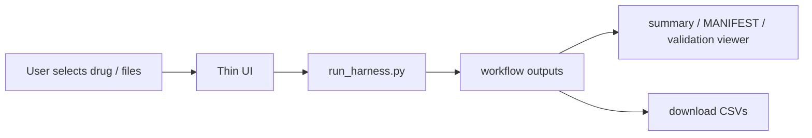

# App Decision: CLI First, Optional Thin UI Later

この文書は、Milestone 9として **このハーネスをShinyなどでアプリ化するべきか** を判断した記録です。

## Decision

現時点では、フルアプリ化は **まだ不要** です。

推奨は次の順です。

1. `README.md` / `docs/QUICKSTART.md` / `docs/USER_GUIDE.md` とCLIで運用する
2. 非プログラマーが繰り返し使う段階で、薄いUIを追加する
3. UIを作る場合も、`pk.yml` やspecを直接編集するアプリではなく、`tools/run_harness.py` を呼ぶlauncher / manifest viewerに限定する

## Why Not Build A Full App Now

現状の目的は、臨床薬理モデルの妥当化ではなく、SDTM -> ADaM -> NCA / PopPK workflowを早く回すためのdummy fixture作成です。

この目的に対して、現在のCLI構成はすでに次を満たしています。

| Requirement | Current state |
| --- | --- |
| 初見実行 | `docs/QUICKSTART.md` で複数薬剤デモまで実行可能 |
| 複数薬剤デモ | `tools/run_harness.py harness_examples/demo_set.yml` でOK/WARN/FAILED例を作成可能 |
| 下流接続 | `analysis_inputs/ADPC.csv`, `NCA_INPUT.csv`, `POPPK_INPUT.csv` を生成可能 |
| 監査性 | `MANIFEST.yml`, `trace.log`, validation report が残る |
| 安全性 | `run_workflow.py` は `pk.yml`, `targets.yml`, specを更新しない |
| 既存データ利用 | 既存 `DM/VS/LB/PC` skeletonを受け取り、PC濃度だけ補完可能 |

フルアプリ化すると、次の追加コストが発生します。

| Cost | Risk |
| --- | --- |
| UI状態管理 | CLIで明示されていた設定が画面状態に隠れる |
| ファイルアップロード/保存 | 既存SDTM-like skeletonや出力物の追跡が複雑になる |
| 実行環境依存 | mrgsolve runner, R, Python, simPopの依存管理が重くなる |
| ガバナンス | `pk.yml` 更新、calibration、validationの分離が曖昧になりやすい |
| テスト負荷 | UI regression, file IO, long-running job管理が必要になる |

## When An App Becomes Worth It

次の条件が2つ以上満たされたら、アプリ化を再検討する価値があります。

| Trigger | Meaning |
| --- | --- |
| 非プログラマーが定期利用する | CLI操作がボトルネックになる |
| 薬剤選択とsummary確認だけを頻繁に行う | UIの価値が高い |
| 既存SDTM skeleton uploadが多い | ファイル選択UIが便利になる |
| NCA/PopPK adapter仕様が固定された | 出力列をUIで説明しやすい |
| 外部mrgsolve runnerの実行方法が固定された | アプリから安全に呼び出せる |

## Current Extension Priority

フルアプリ化の前に、次の拡張を優先します。

| Priority | Extension | Reason |
| --- | --- | --- |
| 1 | `examples/` の最小成果物 | 初見ユーザーが出力形をすぐ理解できる |
| 2 | harness config schema validation | UIやCLIの設定ミスを早く止められる |
| 3 | NCA/PopPK tool別adapter | 下流parser smoke testに使いやすくなる |
| 4 | 軽量IIV/residual option | 濃度統計やplotが実データに少し近づく |
| 5 | Quarto reference-doc | Word共有時の見た目を揃えやすい |
| 6 | thin UI / cloud runner検討 | 上記が固定されてからでよい |

## Recommended App Shape If Built

作るなら、最初のアプリは **thin launcher + manifest viewer** に限定します。



やること:

- 薬剤slug選択
- `run_harness.py` の実行
- harness YAML configの選択
- 既存 `DM/VS/LB/PC` skeletonの指定
- `summary.md`, `MANIFEST.yml`, `simulation_validation.md` の表示
- `ADPC.csv`, `NCA_INPUT.csv`, `POPPK_INPUT.csv` のダウンロード

やらないこと:

- `pk.yml` の直接編集
- 文献値の自動更新
- calibration結果のcanonical PKへの自動反映
- 臨床的に正しい/誤りという判定表示
- submission-ready SDTM/ADaMであるかのような表示

## Shiny vs Other Options

| Option | Fit | Comment |
| --- | --- | --- |
| CLI + docs | Best now | 現在の目的には十分。監査性も高い |
| Shiny | Good later if R/mrgsolve users are primary | Pharma/Rユーザーには自然。ただし現在のcore toolsはPython中心 |
| Streamlit | Good later if Python workflow stays primary | Python toolsを直接呼びやすい。簡易viewerに向く |
| Static HTML report | Useful now as add-on | 実行後summaryを見せるだけならアプリより軽い |

客観的には、今すぐ作るならShinyよりも **static report強化** または **Python thin UI** の方が軽いです。R/mrgsolve runnerをアプリから直接実行したい段階になったら、Shinyの優先度が上がります。

## Acceptance For Milestone 9

Milestone 9は、次を満たせば到達とします。

```text
[x] アプリ化の必要性を客観評価した
[x] 現時点ではフルアプリ化しない判断を明文化した
[x] 将来アプリ化する場合の範囲を thin launcher / manifest viewer に限定した
[x] pk.yml更新、validation、calibrationの分離をUIでも維持すると明記した
[x] README / USER_GUIDEからこの判断へ辿れる
```

## Bottom Line

現時点では **アプリを作らないことが最適化** です。

このハーネスは、CLIとQuickstartでMilestone 8までの目的を満たしています。Milestone 9では、アプリ化を急がず、利用頻度と利用者層を見てから薄いUIを足す判断にします。
