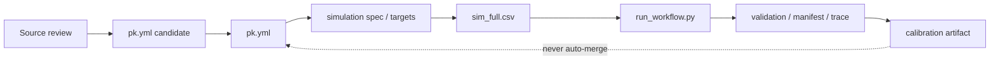

# pkdummy-harness Codex Notes

この文書は、Codexや開発者がこのリポジトリを安全に編集するための内部運用メモです。利用者向けの実行手順は [USER_GUIDE.md](USER_GUIDE.md) を見てください。

初見ユーザー向けの最短デモ手順は [QUICKSTART.md](QUICKSTART.md) です。READMEからQuickstart、詳細はUSER_GUIDE、内部運用はこの文書、という導線にします。

アプリ化の判断は [APP_DECISION.md](APP_DECISION.md) に残します。現時点では、ShinyなどのフルアプリではなくCLI + docsを標準とし、将来作る場合もthin launcher / manifest viewerに限定します。

Shiny Cloud/Tauri/CLI launcherから呼ぶ入出力契約は [LAUNCHER_CONTRACT.md](LAUNCHER_CONTRACT.md) に残します。UIは `run_harness.py` を呼び、`HARNESS_STATUS.json` を読む構成にしてください。

Claude Code向けには、rootの `CLAUDE.md` から同じ `AGENTS.md` に誘導します。CodexとClaude Codeで別々の運用ルールを持たせず、repository canonical ruleは `AGENTS.md` に集約します。

## Scope

このハーネスの目的は、SDTM -> ADaM -> NCA / PopPK ワークフロー検証用の **PK-like synthetic data** を安定して作ることです。臨床推論用モデルの妥当化、投与設計、規制提出用の証明は目的外です。

## Required Checks

通常の変更後:

```bash
make validate
```

コード、単位変換、生成ロジック、薬剤YAML、INDEXを触った後:

```bash
make harness-check
```

内訳:

- `make validate`: `pk.yml` / `targets.yml` / `spec` / repo hygiene の確認
- `make test`: parser、unit conversion、template generation、simulation validation の単体テスト
- `make regen-check`: `INDEX.csv` が `drugs/*/pk.yml` から再現できるか確認

## File Responsibilities

| Path | Role | Edit policy |
| --- | --- | --- |
| `drugs/<slug>/pk.yml` | source/raw/parsed/derived PK summary | 数値変更は根拠、単位、式を残す |
| `drugs/<slug>/targets.yml` | AUC/t1/2 の最低限チェック用 target | 文献値や計算式と矛盾させない |
| `drugs/<slug>/spec_pk1_*.yml` | 1-compartment simulation spec | workflow fixture として扱う |
| `tools/harvest_and_generate.py` | DailyMed/PubMed harvest and generation | 文献更新経路として維持 |
| `tools/pk_fixture_cli.py` | `pk-fixture` / `python -m tools.pk_fixture_cli` の正式CLI入口 | 既存ツールへdispatchする薄い層。PK値変更やworkflow再実装はしない |
| `tools/run_harness.py` | YAML configからdemo/post-simulation workflowを起動する共通入口 | UIやクラウドから呼んでもPK値変更はしない |
| `tools/run_workflow.py` | `sim_full.csv` 後の検証、採血抽出、SDTM-like生成、ADPC-like/NCA/PopPK入力生成、trace作成を一括実行 | 外部runner実行やPK値変更はしない |
| `tools/run_demo_set.py` | 複数薬剤デモ用 `sim_full.csv` 生成と `run_workflow.py` 一括実行 | mrgsolve runnerの代替やPK値変更はしない |
| `tools/validate_harness_config.py` | `run_harness.py` のYAML configを軽量schema validationする | 実行前の設定ミス検出。PK値には触れない |
| `tools/validate_simulation.py` | `sim_full.csv` のAUC/Cmax/Tmax/t1/2再計算 | 自動最適化ではなく検査 |
| `tools/sample_clinical_timepoints.py` | dense simulation output を名目採血時点へ疎化 | SDTM/ADaM/NCA workflow fixture 用 |
| `tools/make_sdtm_like_domains.py` | `clinical_samples.csv` から限定版 DM/VS/LB/EX/PC CSV とMANIFESTを生成 | submission-ready SDTMではない |
| `tools/make_analysis_inputs.py` | SDTM-likeからADPC-like/NCA/PopPK smoke-test CSVとMANIFESTを生成 | submission-ready ADaMやモデル固有NONMEM datasetではない |
| `tools/make_downstream_adapters.py` | ADPC/POPPK_INPUTからR NCA/Phoenix/NONMEM/nlmixr2風adapter CSVを生成 | parser/control-stream smoke test用。正式tool datasetではない |
| `tools/make_site_adapters.py` | YAML mappingから施設別CSV adapterと `SITE_ADAPTER_MANIFEST.yml` を生成 | 施設別列名調整用。submission-ready ADaMや正式tool datasetではない |
| `tools/validate_downstream_adapters.py` | adapter CSVのrepository-owned contractを検証する | 外部ツール公式仕様の認証ではない |
| `tools/run_downstream_smoke.py` | adapter生成、簡易NCA、PopPK parser template作成を一括確認する | fixture-level E2E。Phoenix/NONMEM/nlmixr2本体は実行しない |
| `tools/run_external_tool_validation.py` | 同じrepo内のprofileからPhoenix/NONMEM/nlmixr2等の外部実行環境を任意確認する | 外部ツール本体・ライセンスは同梱しない。`--execute`なしではprobeのみ |
| `tools/render_manifest_viewer.py` | `MANIFEST.yml` を静的HTML viewerに変換する | thin UIの最小形。ハーネス実行やPK編集はしない |
| `tools/check_examples.py` | versioned minimal examplesを一時再生成して出力driftを検出する | 例示用artifactの列・件数が知らないうちに変わるのを防ぐ |
| `tools/doctor.py` | Python/R/Quarto/simPopのpreflight確認を行う | 任意依存不足はWARNとして扱い、CLI本体を過剰に重くしない |
| `tools/validate_manifest.py` | `MANIFEST.yml` の必須fieldと基本型を確認する | artifactの監査性を保つ。臨床的正しさのvalidationではない |
| `tools/report_pk_fixture.R` | ADPC-likeから被験者背景、濃度統計、linear/log ggplotを含む記述統計レポートを生成 | fixture確認用。臨床薬理妥当化やsubmission-ready ADaM reportではない |
| `tools/render_pk_fixture_quarto.R` | `templates/pk_fixture_report.qmd` を使って記述統計レポートをQuarto docxへ変換 | 任意の共有用artifact。一次的な再現性はCSV/Markdown/PNG/manifest側 |
| `outputs/review/` | review/calibration/validation notes | 監査ログ。canonical PK値ではない |

## Safe Editing Rules

- PK値を推測だけで作らない。
- `pk_raw`, `sources`, `pk_parsed`, `derived` の対応関係を壊さない。
- 経口薬の CL/V は原則として見かけ値（CL/F, V/F）として扱う。
- systemic CL/V に切り替える場合は、F、根拠、式を明記する。
- `simPop` は被験者属性CSVの任意生成だけに使う。PK個人差の根拠にはしない。
- `validate_simulation.py` の WARN/FAILED は、値の自動修正ではなく見直しのサインとして扱う。
- PC濃度単位は入力列または `--pc-conc-unit` で明示する。単位が不明な場合だけfixture既定の `ng/mL` を使う。
- PopPK `CMT` は parser smoke fixture の convention であり、実モデルでは `--dose-cmt` / `--observation-cmt` またはsite adapter/control streamで合わせる。

## PK Value Governance

| Component | Allowed | Not allowed |
| --- | --- | --- |
| `run_workflow.py` | post-simulation workflow生成、manifest/trace保存 | `pk.yml`, `targets.yml`, specの更新 |
| `validate_simulation.py` | WARN/FAILEDの判定とレポート作成 | PK値の自動最適化 |
| `harvest_and_generate.py` | 文献・label由来のPK更新候補作成 | simulation結果に合わせた文献値生成 |
| `drugs/<slug>/pk.yml` | source/raw/parsed/derived整合性を保ったcanonical更新 | calibration値や根拠不明値の混入 |
| calibration artifact | review/demo/stress test用の別管理 | canonical PK libraryへの自動反映 |



## Common Codex Requests

### Harness sanity check

```text
AGENTS.md を読んでから、make harness-check を実行し、失敗があれば原因を整理してください。
```

CLI入口を確認する場合:

```text
python3 -m tools.pk_fixture_cli --help と python3 -m tools.pk_fixture_cli doctor --json を実行し、standalone CLIが既存ツールへ正しくdispatchできるか確認してください。
```

### Parameter update from literature

```text
AGENTS.md と docs/HARVEST.md を読んでから、<drug> の文献情報を確認し、更新できるPKパラメータがあれば pk.yml に反映してください。source/raw/parsed/derived の対応、単位、変換式を説明し、make harness-check を通してください。
```

### Simulation output validation

```text
<run_dir>/raw/sim_full.csv を tools/validate_simulation.py で検証し、AUC/t1/2 の結果を reports に保存してください。WARN/FAILEDなら原因候補を説明し、pk.yml は自動変更しないでください。
```

### Post-simulation workflow

```text
生成済み <run_dir>/raw/sim_full.csv から、tools/run_workflow.py で validate -> sample clinical timepoints -> make SDTM-like domains -> make analysis inputs を一括実行してください。run-level MANIFEST.yml と trace.log を残し、FAILED時は --allow-validation-failed がない限り下流生成へ進めないでください。
```

濃度単位やPopPK CMT conventionが施設仕様で決まっている場合は、`--pc-conc-unit`, `--dose-cmt`, `--observation-cmt` を明示してください。

### Clinical sampling extraction

```text
<run_dir>/raw/sim_full.csv から、指定した名目採血時点だけを tools/sample_clinical_timepoints.py で抽出し、clinical_samples.csv を保存してください。PKパラメータやspecは変更しないでください。
```

### SDTM-like fixture generation

```text
<run_dir>/raw/clinical_samples.csv と実行に使った spec_pk1_*.yml から、tools/make_sdtm_like_domains.py で DM/VS/LB/EX/PC CSV を生成してください。LBはCREATのみ、VSはHEIGHT/WEIGHT/BMI/BSAのみ、EXはspec由来、PCはclinical_samples由来に限定してください。
```

`--subjects-csv` を使う場合は、必要に応じて `--strict-subject-match` を付けてPC側と被験者IDの完全一致を要求してください。警告は `MANIFEST.yml` に残してください。

既存の `DM/VS/LB/PC` skeletonがある場合は、`--dm-csv`, `--vs-csv`, `--lb-csv`, `--pc-csv` を使ってください。`PC` は skeletonを保持して濃度だけを注入します。非空欄の既存濃度を上書きする場合は `--overwrite-existing-pc-conc` を明示してください。

PC濃度単位は、`DV_UNIT`, `DVU`, `CONC_UNIT`, `PCSTRESU`, `PCORRESU` などの入力列から引き継がれます。施設仕様上の単位を固定したい場合は `--pc-conc-unit` を使ってください。

### Analysis input smoke fixture generation

```text
生成済み <run_dir>/workflow/sdtm_like/ から、tools/make_analysis_inputs.py で ADPC.csv / NCA_INPUT.csv / POPPK_INPUT.csv を生成してください。これは下流workflow smoke test用で、submission-ready ADaMやモデル固有NONMEM datasetではないことをMANIFEST.ymlに残してください。
```

PopPK fixtureのCMT値が施設側control streamと合わない場合は、`--dose-cmt` と `--observation-cmt` を指定してください。既定値は投与行 `1`、観測行 `2` です。

### Descriptive PK fixture report

```text
生成済み <run_dir>/workflow/analysis_inputs/ADPC.csv から、tools/report_pk_fixture.R で被験者背景の要約統計、時点別濃度統計、ggplot2のlinear/log濃度プロット、REPORT.mdを生成してください。これはfixture確認用の記述統計で、臨床薬理妥当化やsubmission-ready ADaM reportではないことを説明してください。
```

### Optional Quarto DOCX report

```text
Word共有用のdocxが必要な場合だけ、tools/render_pk_fixture_quarto.R を使って templates/pk_fixture_report.qmd から pk_fixture_report.docx を生成してください。これは既存のREPORT.md/CSV/PNGを置き換えず、共有しやすいpresentation artifactとして扱ってください。Word style referenceが必要なら --reference-doc を指定してください。
```

### Multi-drug demo set

```text
tools/run_harness.py harness_examples/demo_set.yml で albuterol, alprazolam, aciclovir, abciximab, felodipine の複数薬剤デモを実行してください。summary.csv / summary.md / DEMO_MANIFEST.yml / HARNESS_MANIFEST.yml を確認し、WARN/FAILEDはpk.ymlに自動反映しないでください。このデモ用sim_full.csvは解析式generator由来で、mrgsolve runnerの代替ではないことを説明してください。
```

demo用に軽い個体差や残差誤差が必要な場合だけ、`simulation.variability` または `run_demo_set.py --iiv-cv --residual-cv` を使ってください。これはworkflow fixture用の見た目調整で、薬剤固有のIIV/residual modelではありません。

### Downstream adapter generation

```text
生成済み <run_dir>/workflow/analysis_inputs/ から、tools/make_downstream_adapters.py で nca_r.csv / nca_phoenix.csv / poppk_nonmem.csv / poppk_nlmixr2.csv を生成してください。これは下流parser smoke test用adapterで、各ツールの正式dataset仕様を保証しないことを説明してください。
```

### Site-specific adapter generation

```text
生成済み <run_dir>/workflow/analysis_inputs/ から、tools/make_site_adapters.py と external_validation/site_adapter_template.yml を使って施設別CSV adapterを生成してください。列名、固定値、必須非空欄はYAML mappingで定義し、SITE_ADAPTER_MANIFEST.ymlを残してください。これはsubmission-ready ADaMや正式Phoenix/NONMEM datasetではないことを説明してください。
```

## Known Limitations

- Cmax/Tmax target が未構造化の薬剤では、`KA`, `ALAG1`, `F1` を客観検証できない。
- IIV/residual error は多くの薬剤で workflow fixture 用の汎用設定。
- 1-compartment spec は、TMDD、明確な多相性、非線形PKを再現するためのものではない。
- これらは現在の intended use では許容する。補完する場合も、臨床妥当化ではなく workflow fixture として必要な範囲に限定する。
