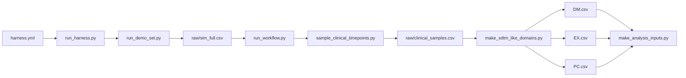

# DM / EX / PC 50例 PKデモデータ仕様

- ステータス: Implemented v0.1
- 作成日: 2026-07-27
- 対象: `pkdummy-harness` の workflow fixture

## 1. 目的

`pkdummy-harness` の既存PK specとデモ生成ツールを使い、50例分の濃度データと、対応する限定版SDTM-like `DM.csv`, `EX.csv`, `PC.csv` を作る。

主用途はCSV取込、ドメイン結合、ADPC/NCA/PopPK入力生成、レポート生成のデモとスモークテストである。臨床予測、用量設定、申請用SDTM/ADaM、モデル妥当性の証明には使用しない。

## 2. v0.1の決定事項

| 項目 | 仕様 |
| --- | --- |
| 薬剤 | `apixaban` 1薬剤 |
| PK参照 | `drugs/apixaban/pk.yml`, `targets.yml`, `spec_pk1_oral.yml` |
| 投与 | Arm A、10 mg、単回経口投与 |
| 症例数 | 50例 |
| シミュレーション | `analytical_demo`、1-compartment workflow fixture |
| 採血時点 | 0, 1, 2, 3, 4, 8, 12, 24 h（8時点/例） |
| 濃度 | `DV` をPCに採用、単位 `ng/mL` |
| 個体差 | demo-only `iiv_cv: 0.1` |
| 残差 | demo-only `residual_cv: 0.05` |
| 乱数seed | `20260217` |
| 基準日時 | `2026-01-01T08:00:00` |
| STUDYID | spec由来の `OSP_apixaban` |

`iiv_cv` と `residual_cv` は既存デモ設定に合わせた見た目上のfixture個体差であり、apixaban固有の推定値とは扱わない。

## 3. 入力契約

実行入口は1つのYAMLとする。`simulation.n_subjects` と demo_setでの `sampling.method` / `sampling.predose_mdv1` は実行時overrideとして `run_harness.py` から `run_demo_set.py` へ引き渡す。canonical specは書き換えない。

```yaml
version: "0.1"
mode: demo_set
drugs_dir: drugs
out_dir: outputs/demo_dm_ex_pc_50
drugs:
  - apixaban
simulation:
  engine: analytical_demo
  n_subjects: 50
  variability:
    iiv_cv: 0.1
    residual_cv: 0.05
    seed: 20260217
sampling:
  times_h: [0, 1, 2, 3, 4, 8, 12, 24]
  method: exact
  predose_mdv1: true
validation:
  allow_failed: false
```

### 入力バリデーション

- `drugs` はv0.1では1薬剤のみとする。
- `simulation.n_subjects` は1以上の整数とし、本仕様では50を必須とする。
- 複数armの薬剤specに単一の `n_subjects` を与えた場合は自動配分せずエラーとする。v0.1のapixaban specは単一armである。
- 採血時点は重複なしの非負数とし、specのシミュレーション範囲内とする。
- `method: exact` のため、全指定時点が0.5 h間隔の `sim_full.csv` に実在することを必須とする。
- canonicalな `pk.yml`, `targets.yml`, `spec_pk1_oral.yml` は書き換えない。症例数の50例化は実行時オーバーライドだけで適用する。

## 4. データフロー



`analytical_demo` は既存specの `model.theta` から解析式で濃度形状を作る。mrgsolve runnerの代替とは表現しない。mrgsolveを使う場合は、外部runnerが作成した `sim_full.csv` を `post_simulation` モードに渡す別経路とする。

## 5. 出力と件数

以下のパスは `<run_dir> = outputs/demo_dm_ex_pc_50/apixaban` からの相対パスとする。

| 出力 | 予定件数 | 説明 |
| --- | ---: | --- |
| `raw/sim_full.csv` | 7,250 | 50例 × 145時点（0–72 h、0.5 h間隔） |
| `workflow/raw/clinical_samples.csv` | 400 | 50例 × 8採血時点 |
| `workflow/sdtm_like/DM.csv` | 50 | 1例1行 |
| `workflow/sdtm_like/EX.csv` | 50 | 1例1投与 |
| `workflow/sdtm_like/PC.csv` | 400 | 1例8採血行 |
| `workflow/sdtm_like/VS.csv` | 200 | 既存workflowの副生成物、4項目/例 |
| `workflow/sdtm_like/LB.csv` | 50 | 既存workflowの副生成物、CREAT 1行/例 |
| `workflow/analysis_inputs/ADPC.csv` | 400 | 下流スモークテスト用 |
| `workflow/analysis_inputs/NCA_INPUT.csv` | 400 | 下流スモークテスト用 |
| `workflow/analysis_inputs/POPPK_INPUT.csv` | 450 | 50投与行 + 400観測行 |

加えて `HARNESS_STATUS.json`, `HARNESS_MANIFEST.yml`, `DEMO_MANIFEST.yml`, workflow `MANIFEST.yml`, `trace.log`, `simulation_validation.md` を出力する。

## 6. ドメイン仕様

### 6.1 DM

主キーは `USUBJID`。`USUBJID` は `OSP_apixaban-001` から `OSP_apixaban-050` までとする。

| 列 | 規則 |
| --- | --- |
| `STUDYID` | `OSP_apixaban` |
| `DOMAIN` | `DM` |
| `USUBJID` | study ID + 3桁番号 |
| `SUBJID` | `1`–`50` |
| `RFSTDTC`, `RFENDTC` | `2026-01-01` |
| `ARM`, `ACTARM` | `A` |
| `AGE` | 現行demo generatorの決定的規則、40–59歳 |
| `AGEU` | `YEARS` |
| `SEX` | 奇数ID=`M`、偶数ID=`F`（25例ずつ） |

体重は `sim_full.csv` とVSに64, 67, 70, 73, 76 kgの決定的パターンで入るが、v0.1の濃度式のCL/V/KA共変量には接続しない。

### 6.2 EX

主キーは `USUBJID + EXSEQ`。1例に1行作成する。

| 列 | 規則 |
| --- | --- |
| `STUDYID` | `OSP_apixaban` |
| `DOMAIN` | `EX` |
| `USUBJID` | DMと完全一致 |
| `EXSEQ` | 1–50の決定的連番 |
| `EXTRT` | `APIXABAN` |
| `EXDOSE` | `10` |
| `EXDOSU` | `mg` |
| `EXROUTE` | `ORAL` |
| `EXINFH` | `0` |
| `EXSTDTC`, `EXENDTC` | `2026-01-01T08:00:00` |
| `EXARM`, `EXACTARM` | `A` |

### 6.3 PC

主キーは `USUBJID + PCSEQ`。DMの各50例に8行ずつ作成する。

| 列 | 規則 |
| --- | --- |
| `STUDYID` | `OSP_apixaban` |
| `DOMAIN` | `PC` |
| `USUBJID` | DMと完全一致 |
| `PCSEQ` | 出力全体で決定的な1–400連番 |
| `PCTESTCD` | `DRUGCONC` |
| `PCTEST` | `Drug Concentration` |
| `PCORRES`, `PCSTRESN` | `clinical_samples.csv` の `DV` |
| `PCORRESU`, `PCSTRESU` | `ng/mL` |
| `PCTPTNUM` | 1–8 |
| `PCTPT` | `Pre-dose`, `1 h`, `2 h`, `3 h`, `4 h`, `8 h`, `12 h`, `24 h` |
| `PCELTM` | `PT0H`, `PT1H`, `PT2H`, `PT3H`, `PT4H`, `PT8H`, `PT12H`, `PT24H` |
| `PCDTC` | 基準日時 + 実採血時間 |
| `PCMDV` | Pre-doseのみ `1`、その他は `0` |

specに根拠のあるLLOQがないため、`PCLLOQ` は空欄とし、BLQ判定を作らない。Pre-dose行は採血ポイントとして残すが、PopPK観測尤度に使わないよう `MDV=1` とする。

## 7. 濃度生成規則

- CL, V, KA, F1, ALAG1、濃度単位、投与量は `drugs/apixaban/spec_pk1_oral.yml` の値をそのまま使う。本仕様にPK値を複製しない。
- デモ生成ではCL, V, KAに同一CVの独立lognormal factorを適用し、`DV` にdemo-onlyの比例残差を加える。
- `CP` と `IPRED` は残差なし、`DV` は残差ありとする。PCには `DV` を採用する。
- 濃度は負値にしない。
- WT, AGE, SEXはドメイン結合デモ用の属性であり、現行v0.1ではCL/V/KAの共変量モデルに使わない。
- 同じseedと入力の再実行でCSVデータは一致する。manifestの実行時刻は再現性比較から除外する。

## 8. 実装状況

実装済みの変更は次のとおり。

1. `tools/run_demo_set.py`
   - `n_subjects_override` を受け、単一armの実行時人数だけを50にする。
   - コマンド行に `--n-subjects` を追加する。
   - sampling methodと `predose_mdv1` を `run_workflow()` へ引き渡す。
2. `tools/run_harness.py`
   - `simulation.n_subjects`, `sampling.method`, `sampling.predose_mdv1` をdemo_set実行に引き渡す。
3. `tools/validate_harness_config.py`
   - `simulation.n_subjects` の正の整数チェックを追加する。
4. manifest/status
   - 要求症例数、実生成症例数、採血スケジュール、sampling method、seed、demo-only variabilityを記録する。
5. テスト
   - 50例override、不正な人数、複数armの曖昧性防止、Pre-dose MDV、件数、再現性をカバーする。

6. CDISC API補助アダプタ
   - `tools/fetch_cdisc_reference.py` でDM/EXの参照fixtureを任意取得できる。
   - API取得物は `CDISC_API_MANIFEST.yml` にURL、リクエスト条件、行数、症例数、SHA-256を記録する。
   - API取得物はPK workflowへ自動結合せず、PC濃度はpkdummy生成物を正とする。

## 9. 受け入れ条件

- 実行は異常終了せず、workflow statusとvalidation statusがともに `OK` となる。
- DM=50行、EX=50行、PC=400行である。
- DMの `USUBJID` は50件ユニークである。EXとPCのすべての `USUBJID` がDMに存在する。
- 各例にEXが1行、PCが8行ある。
- 各例のPC時点集合が `{0, 1, 2, 3, 4, 8, 12, 24}` hと一致する。
- `PCSTRESN` はPre-doseを含めて数値で、全行で `PCSTRESN >= 0`、単位は `ng/mL` である。
- Pre-dose行は `PCMDV=1`、その他は `PCMDV=0` である。
- EXの投与量、単位、経路がspecと一致する。
- 同一seedで2回生成したDM/EX/PCのファイルchecksumが一致する。
- `pk.yml`, `targets.yml`, `spec_pk1_oral.yml`, `INDEX.csv`, `pk_library.yml` に差分がない。
- `make harness-check` が通る。

## 10. 非目標

- submission-ready SDTM/ADaM/XPTの作成
- 実患者や特定臨床試験の再現
- apixabanの用量妥当性や臨床的予測性能の証明
- 共変量モデル、IOV、欠測メカニズム、相関omega、薬剤固有の残差モデルの再現
- mrgsolve、NONMEM、nlmixr2、Phoenixの実行保証

## 11. 将来拡張

- `subjects.csv` / simPopを使った現実的な人口統計属性
- 複数armまたは複数用量
- LLOQに根拠がある薬剤でのBLQシナリオ
- 欠測、採血時刻jitter、protocol deviationのstress fixture
- 外部mrgsolve runnerが作った `sim_full.csv` と同じDM/EX/PC後処理の接続試験
