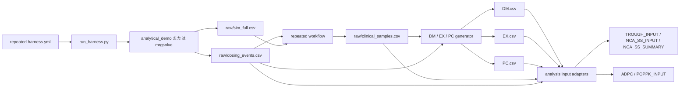

# 反復経口投与・トラフ・定常状態NCA 50例デモ仕様

- ステータス: Implemented v0.1
- 作成日: 2026-07-27
- 対象: `pkdummy-harness` の workflow fixture
- 先行仕様: `docs/DEMO_DM_EX_PC_50_SPEC.md`（単回経口投与）

## 1. 目的

単回投与デモとは別試験として、50例に反復経口投与を行った合成PKデータを作る。経時的なトラフ濃度と、最終投与間隔の濃度推移を限定版SDTM-like `DM.csv`, `EX.csv`, `PC.csv` に格納し、定常状態区間のNCA入力・集計とPopPK入力を作成する。

主用途は、次の処理のデモとスモークテストである。

- 反復投与イベントと濃度観測の時系列結合
- 経時トラフ濃度の抽出
- 最終投与間隔の `AUCtau,ss`、部分AUC、`Cmax,ss`、`Cmin,ss` の算出
- DM / EX / PCからADPC-like、NCA、PopPK入力への変換

臨床的な用量選択、定常状態到達の医学的証明、申請用SDTM/ADaM、モデル妥当性の証明には使用しない。

## 2. v0.1の決定事項

| 項目 | 仕様 |
| --- | --- |
| 薬剤 | `apixaban` 1薬剤 |
| PK参照 | `drugs/apixaban/pk.yml`, `targets.yml`, `spec_pk1_oral.yml` |
| 試験ID | `OSP_apixaban_repeat`（実行時override） |
| 投与 | Arm A、spec由来10 mg、12時間間隔、反復経口投与 |
| 実投与回数 | 13回、時刻0–144 h |
| 最終NCA区間 | 第13回投与前144 hから次回投与予定前156 hまで |
| 症例数 | 50例 |
| シミュレーション | `analytical_demo` または `mrgsolve`、線形1-compartment反復投与fixture |
| dense grid | 0–156 h、0.5 h間隔、313時点/例 |
| トラフ採血 | 0, 24, 48, 72, 96, 120, 144, 156 h |
| 最終区間採血 | 第13回投与から0, 0.5, 1, 2, 3, 4, 6, 8, 12 h |
| PC総採血数 | 重複する144 hと156 hを統合し、15時点/例 |
| 濃度 | `DV` をPC/NCA観測値に採用、単位 `ng/mL` |
| 個体差 | demo-only `iiv_cv: 0.1` |
| 残差 | demo-only `residual_cv: 0.05` |
| 乱数seed | `20260217` |
| 基準日時 | `2026-01-01T08:00:00` |

投与量、経路、CL、V、KA、F1、ALAG1、濃度単位はcanonical specから読む。反復回数、投与間隔、試験ID、シミュレーション終了時刻はこのデモの実行時設定であり、canonical specへ書き戻さない。

`iiv_cv` と `residual_cv` は見た目上のfixture個体差であり、apixaban固有の推定値とは扱わない。12時間間隔13回投与もデータ処理試験用の運用条件であり、臨床用量の推奨を意味しない。

## 3. 入力契約

実装後の実行入口は1つのYAMLとする。

```yaml
version: "0.1"
mode: repeated_oral_demo
drugs_dir: drugs
out_dir: outputs/demo_repeated_oral_trough_ss_50
drugs:
  - apixaban
study:
  id_override: OSP_apixaban_repeat
  start_datetime: "2026-01-01T08:00:00"
simulation:
  # analytical_demo または mrgsolve
  engine: mrgsolve
  n_subjects: 50
  t_end_h: 156
  dt_h: 0.5
  repeated_dosing:
    interval_h: 12
    dose_count: 13
    analysis_dose_number: 13
  variability:
    # analytical_demo の見た目用パラメータ。mrgsolve はspecの iiv.eta/residualを使う
    iiv_cv: 0.1
    residual_cv: 0.05
    seed: 20260217
sampling:
  trough_times_h: [0, 24, 48, 72, 96, 120, 144, 156]
  ss_times_after_dose_h: [0, 0.5, 1, 2, 3, 4, 6, 8, 12]
  method: exact
nca:
  concentration: DV
  integration: linear-up-log-down
  interval_h: [0, 12]
  partial_intervals_h:
    - [0, 4]
    - [4, 12]
validation:
  allow_failed: false
```

### 3.1 入力バリデーション

- `mode` は `repeated_oral_demo` とする。既存の単回投与 `demo_set` の挙動は変更しない。
- v0.1では1薬剤、単一arm、経口、1-compartment first-order absorption specだけを受け付ける。
- `simulation.n_subjects` は正の整数とする。配布する50例デモ設定では50を指定し、
  小さい値はR/mrgsolveコンパイル確認などの短時間smoke test用overrideとして許容する。
- `interval_h > 0`、`dose_count >= 2`、`1 <= analysis_dose_number <= dose_count` を必須とする。
- 第n回投与時刻は `(n - 1) × interval_h` とする。第13回投与時刻は144 hである。
- `t_end_h` は `analysis_dose_time_h + nca.interval_h[1]` 以上とする。本仕様では156 hである。
- トラフ時刻と最終区間時刻は重複を統合し、昇順・重複なし・非負とする。
- `method: exact` のため、全採血時刻が0.5 h grid上に存在することを必須とする。
- 部分NCA区間は連続して最終区間全体を被覆し、境界時刻4 hと12 hが採血スケジュールに存在することを必須とする。
- spec由来の投与量、CL、V、KAは正値、F1は非負、ALAG1は非負であることを確認する。
- `engine: analytical_demo` はPythonの再現可能な解析式fixture、`engine: mrgsolve` は
  `tools/mrgsolve_runner.R` によるODE積分fixtureである。mrgsolveではcanonical specの
  `iiv.eta`（対角OMEGA分散）と `residual.prop/add` を使い、`variability.iiv_cv`/
  `residual_cv` は解析式経路でのみ使う。
- canonicalな `pk.yml`, `targets.yml`, `spec_pk1_oral.yml` は変更しない。

## 4. 投与・採血スケジュール

### 4.1 投与イベント

50例全員に同一名目スケジュールを適用する。投与時刻は0, 12, 24, ..., 144 hの13回である。156 hは次回投与予定前の採血だけを行い、第14回投与は生成しない。

同一時刻に採血と投与がある場合は、必ず `PRE_DOSE_OBSERVATION → DOSE` の順に扱う。特に0 h、24 h、48 h、72 h、96 h、120 h、144 hでは採血後に投与する。PopPK入力には同時刻内の順序を保持する `ROW_ORDER` を付ける。

### 4.2 採血時点

| 絶対時刻 (h) | 区分 | 最終投与後時刻 (h) | PCTPT例 |
| ---: | --- | ---: | --- |
| 0 | 初回投与前baseline | - | `Baseline pre-dose` |
| 24 | 経時トラフ | - | `Day 2 AM trough` |
| 48 | 経時トラフ | - | `Day 3 AM trough` |
| 72 | 経時トラフ | - | `Day 4 AM trough` |
| 96 | 経時トラフ | - | `Day 5 AM trough` |
| 120 | 経時トラフ | - | `Day 6 AM trough` |
| 144 | 経時トラフ + 最終NCA起点 | 0 | `Day 7 pre-dose / SS 0 h` |
| 144.5 | 最終NCA | 0.5 | `SS 0.5 h` |
| 145 | 最終NCA | 1 | `SS 1 h` |
| 146 | 最終NCA | 2 | `SS 2 h` |
| 147 | 最終NCA | 3 | `SS 3 h` |
| 148 | 最終NCA | 4 | `SS 4 h` |
| 150 | 最終NCA | 6 | `SS 6 h` |
| 152 | 最終NCA | 8 | `SS 8 h` |
| 156 | 最終NCA終点 + 次回投与予定前トラフ | 12 | `SS 12 h / pre-next-dose` |

0 h baselineだけは `MDV=1` とし、PopPK尤度およびトラフ定常化評価から除外する。24–156 hのトラフと最終NCA区間は `MDV=0` とする。

## 5. データフロー



`dosing_events.csv` を反復投与スケジュールの正本とする。EXとPopPK dosing rowsはこのファイルから生成し、PC濃度と投与時刻の不整合を防ぐ。外部CDISC APIのDM/EXは比較用fixtureに限定し、本経路へ自動結合しない。

## 6. 出力と予定件数

以下は `<run_dir> = outputs/demo_repeated_oral_trough_ss_50/apixaban` からの相対パスである。
`analytical_demo` では `sim_full.csv` は観測行のみ、`mrgsolve` では観測行に加えて
`EVID=1` の投与イベント行を含む。したがってmrgsolve経路の件数は
`subjects × (dense_grid_points + dose_count)` となるが、EX生成とNCAの件数は同じである。

| 出力 | 予定件数 | 説明 |
| --- | ---: | --- |
| `raw/sim_full.csv` | 15,650 / 16,300 | analytical_demo: 50例 × 313観測時点。mrgsolve: これに50例×13投与イベントを加算 |
| `raw/dosing_events.csv` | 650 | 50例 × 13投与 |
| `workflow/raw/clinical_samples.csv` | 750 | 50例 × 15ユニーク採血時点 |
| `workflow/sdtm_like/DM.csv` | 50 | 1例1行 |
| `workflow/sdtm_like/EX.csv` | 650 | 1例13投与行 |
| `workflow/sdtm_like/PC.csv` | 750 | 1例15採血行 |
| `workflow/sdtm_like/VS.csv` | 200 | 4項目/例 |
| `workflow/sdtm_like/LB.csv` | 50 | CREAT 1行/例 |
| `workflow/analysis_inputs/ADPC.csv` | 750 | 全PC観測のADPC-like入力 |
| `workflow/analysis_inputs/NCA_INPUT.csv` | 750 | 汎用濃度時系列。SS NCAの直接入力にはしない |
| `workflow/analysis_inputs/TROUGH_INPUT.csv` | 400 | 50例 × 8トラフ時点 |
| `workflow/analysis_inputs/NCA_SS_INPUT.csv` | 450 | 50例 × 最終投与間隔9時点 |
| `workflow/analysis_inputs/NCA_SS_SUMMARY.csv` | 50 | 1例1行の定常状態NCA指標 |
| `workflow/analysis_inputs/TROUGH_SUMMARY.csv` | 50 | 1例1行のトラフ推移QC |
| `workflow/analysis_inputs/MODEL_QC.csv` | 50 | dense IPREDの最終投与間隔AUCとDose/CL-derived targetの比較 |
| `workflow/analysis_inputs/POPPK_INPUT.csv` | 1,400 | 650投与行 + 750観測行 |

加えて `HARNESS_STATUS.json`, `HARNESS_MANIFEST.yml`, repeated workflow `MANIFEST.yml`, `trace.log`, `simulation_validation.md` を出力する。

## 7. ドメイン仕様

### 7.1 DM

主キーは `USUBJID`。`USUBJID` は `OSP_apixaban_repeat-001` から `OSP_apixaban_repeat-050` とする。

| 列 | 規則 |
| --- | --- |
| `STUDYID` | `OSP_apixaban_repeat` |
| `DOMAIN` | `DM` |
| `USUBJID` | study ID + 3桁番号 |
| `SUBJID` | `1`–`50` |
| `RFSTDTC` | `2026-01-01` |
| `RFENDTC` | `2026-01-07` |
| `ARM`, `ACTARM` | `A` |
| `AGE`, `AGEU`, `SEX` | 単回投与デモと同じ決定的fixture規則 |

### 7.2 EX

主キーは `USUBJID + EXSEQ`。各例に13行作成する。

| 列 | 規則 |
| --- | --- |
| `STUDYID` | `OSP_apixaban_repeat` |
| `DOMAIN` | `EX` |
| `USUBJID` | DMと完全一致 |
| `EXSEQ` | 各被験者内で1–13 |
| `EXTRT` | `APIXABAN` |
| `EXDOSE` | canonical specのArm Aから取得（現行10） |
| `EXDOSU` | `mg` |
| `EXROUTE` | `ORAL` |
| `EXSTDTC`, `EXENDTC` | 基準日時 + `(EXSEQ - 1) × 12 h` |
| `EXARM`, `EXACTARM` | `A` |

`EXSEQ=13` は `2026-01-07T08:00:00`。156 hにはEX行を作らない。

### 7.3 PC

主キーは `USUBJID + PCSEQ`。各例に15行作成する。

| 列 | 規則 |
| --- | --- |
| `STUDYID` | `OSP_apixaban_repeat` |
| `DOMAIN` | `PC` |
| `USUBJID` | DMと完全一致 |
| `PCSEQ` | 各被験者内で1–15 |
| `PCTESTCD`, `PCTEST` | `DRUGCONC`, `Drug Concentration` |
| `PCORRES`, `PCSTRESN` | `clinical_samples.csv` の `DV` |
| `PCORRESU`, `PCSTRESU` | `ng/mL` |
| `PCDTC` | 基準日時 + 絶対採血時刻 |
| `PCTPT`, `PCTPTNUM` | 4.2の15時点を昇順に1–15 |
| `PCELTM` | 初回投与からの絶対経過時間 |
| `PCMDV` | 0 h baselineのみ`1`、他は`0` |

最終NCA区間とトラフ抽出に必要な情報は、analysis adapterで次のfixture-only列として保持する。これらはsubmission-ready SDTM変数とは扱わない。

| 列 | 規則 |
| --- | --- |
| `TROUGHFL` | 0, 24, 48, 72, 96, 120, 144, 156 hで`Y` |
| `SSNCAFL` | 144–156 hの9時点で`Y` |
| `TAD_H` | `SSNCAFL=Y`では第13回投与からの0–12 h |
| `DOSESEQ_REF` | 最終NCA区間では`13` |

formal SDTMへの変換が必要な場合は、これらの補助列をADaM導出またはSUPPPCへ移す。v0.1ではworkflow fixture内の明示的な補助列として扱う。

## 8. 反復投与濃度生成規則

- 各被験者についてCL、V、KAの個体差factorを1回だけ生成し、全13投与・全時点で固定する。
- 各投与による1-compartment経口濃度を重ね合わせ、時刻tの予測濃度を過去の全投与寄与の和として計算する。
- 投与時刻を `d_i`、`u = t - d_i - ALAG1` とし、`u > 0` の投与だけを加算する。CL、V、KA、F1、ALAG1、単位変換はcanonical specを使う。
- `CP` と `IPRED` は残差なしの重ね合わせ濃度、`DV` は同一時点のIPREDへdemo-only比例残差を加えた値とする。
- `DV`, `IPRED`, `CP` は負値にしない。
- 0 h baselineは過去投与がないため0とする。
- `CL_FACTOR`, `V_FACTOR`, `KA_FACTOR` は同一被験者内で固定したdemo-only個体差の追跡用列であり、canonical PK値の置換ではない。
- 同一seedと入力の再実行では、`dosing_events.csv`, `DM.csv`, `EX.csv`, `PC.csv` およびanalysis CSVのchecksumが一致する。

## 9. トラフおよび定常状態の扱い

### 9.1 トラフ濃度

`TROUGH_INPUT.csv` は8時点/例のlong形式とし、少なくとも `USUBJID`, `TIME_H`, `STUDY_DAY`, `DOSESEQ_NEXT`, `DV`, `IPRED`, `CONC_UNIT`, `MDV` を持つ。

- 0 hはbaselineであり、定常化評価には使わない。
- 24–144 hは投与直前採血である。
- 156 hは第14回投与予定直前相当だが、第14回投与は実施しない。
- 観測トラフの表示・NCAには`DV`、シミュレーション定常化QCには残差なし`IPRED`を使う。

`TROUGH_SUMMARY.csv` は1例1行とし、120 hと144 hのIPREDトラフの相対変化を出力する。

```text
PRED_TROUGH_REL_CHANGE = abs(IPRED_144 - IPRED_120) / IPRED_144
```

`PRED_TROUGH_REL_CHANGE <= 0.05` をfixture-levelの安定化QCとする。この5%はデータ生成経路の検査閾値であり、臨床的な定常状態判定基準ではない。`DV`のトラフ差には残差が入るため、合否判定に使わない。

### 9.2 定常状態区間の位置づけ

第13回投与後144–156 hを「SS analysis interval」と呼ぶ。ただし、名称だけで定常状態を保証せず、次をmanifestとsummaryに残す。

- 投与回数、投与間隔、最終投与番号
- 120 hと144 hの予測トラフ相対変化
- dense IPREDから計算した最終区間AUCと、線形モデルのDose/CL由来fixture targetとの差

これはモデル内の数値的な安定化確認であり、実患者の定常状態到達の証拠ではない。

## 10. 定常状態NCA仕様

### 10.1 入力

`NCA_SS_INPUT.csv` は `SSNCAFL=Y` の9時点だけを含み、`TIME_H` は絶対時刻ではなく第13回投与からの `TAD_H=0–12` とする。144 hの投与直前濃度を0 h点、156 hの次回投与予定直前濃度を12 h点として扱う。

NCAは観測値`DV`を使用する。baseline 0 hは最終区間外なので含めない。BLQ規則はcanonical specに根拠あるLLOQがないためv0.1では適用しない。

### 10.2 積分と出力指標

上昇区間はlinear、下降し、かつ区間両端が正値のときはlog-linearで台形積分する。ゼロまたは欠測を含む区間はlog変換せず、入力QCの上でlinearへfallbackする。0、4、12 hは実採血点なので、部分区間境界で補間しない。

| 出力列 | 定義 |
| --- | --- |
| `AUC0_4_SS` | TAD 0–4 hの部分AUC |
| `AUC4_12_SS` | TAD 4–12 hの部分AUC |
| `AUCTAU_SS` | TAD 0–12 hのAUC |
| `CMAX_SS` | 最終区間の最大観測濃度 |
| `TMAX_SS_H` | `CMAX_SS`の最初のTAD |
| `CPREDOSE_SS` | TAD 0 hの投与直前濃度 |
| `CTROUGH_SS` | TAD 12 hの次回投与予定直前濃度 |
| `CMIN_SS` | 最終区間9時点の最小観測濃度 |
| `CAVG_SS` | `AUCTAU_SS / 12` |
| `FLUCT_PCT_SS` | `(CMAX_SS - CMIN_SS) / CAVG_SS × 100`。`CAVG_SS > 0`の場合だけ算出 |
| `N_POINTS` | 9 |
| `AUC_UNIT` | `ng*h/mL` |

数値整合性として、出力丸め前に `AUCTAU_SS = AUC0_4_SS + AUC4_12_SS` を満たすことを必須とする。

`AUCinf`、terminal `lambda-z`、terminal half-life、extrapolated AUCは算出しない。12時間の反復投与間隔データだけからこれらを評価する設計ではないためである。

### 10.3 モデル内積分QC

観測`DV`によるNCA結果は残差と疎な採血の影響を受けるため、canonical targetへの合否判定には使わない。別にdense `IPRED`の144–156 hを積分し、線形モデルの1投与あたり `F1 × Dose / CL` 由来AUCと比較する。`MODEL_QC.csv` に被験者別のIIV factorを反映したtarget、相対差、fixture QC結果を残す。単位換算はcanonical specの`model.units`を使う。

現行の経口specではCL/Vが見かけ値（CL/F, V/F）である可能性を保持し、F1=1のfixture basisをそのまま使う。systemic CL/Vへの変換や追加のF補正は行わない。これは単位・重ね合わせ・積分器のfixture-level整合性確認であり、独立文献AUC検証ではない。

反復投与dense profileに対して、既存の単回投与用 `AUC0-inf` / terminal half-life validatorをそのまま実行しない。

## 11. 実装済みのワークフロー部品

1. `tools/run_harness.py` / `tools/validate_harness_config.py`
   - `repeated_oral_demo` と `simulation.engine: analytical_demo | mrgsolve` を受け付ける。
2. `tools/run_repeated_oral_demo.py`
   - analytical_demoまたは `tools/mrgsolve_runner.R` を選択し、13投与、156 h grid、同一被験者内IIV固定に対応する。
   - mrgsolveの `EVID=1` 行から `dosing_events.csv` を抽出する。
3. `tools/sample_clinical_timepoints.py`
   - `EVID=0` の観測だけからtrough時点と最終区間時点を統合し、`TROUGHFL`, `SSNCAFL`, `TAD_H`, `DOSESEQ_REF`を付ける。
4. `tools/make_sdtm_like_domains.py` / `tools/make_analysis_inputs.py`
   - `dosing_events.csv`から1例13行のEXを生成し、全EX投与イベントをPopPK dosing rowsへ変換する。
   - 同時刻のpre-dose観測を投与行より前に置く。
5. `tools/make_repeated_nca.py`
   - `clinical_samples.csv` のDVとIPREDを用途別に保持し、`TROUGH_INPUT.csv`, `TROUGH_SUMMARY.csv`, `NCA_SS_INPUT.csv`, `NCA_SS_SUMMARY.csv`を生成する。
   - linear-up/log-down積分と部分AUCを実装し、単体テストで形状を確認する。
6. manifest/status
   - 投与回数、interval、最終解析投与、採血スケジュール、actual counts、seed、simulation engine、NCA methodを記録する。

## 12. 受け入れ条件

- workflow statusとrepeated-dose validation statusがともに`OK`である。
- DM=50、EX=650、PC=750である。
- `dosing_events.csv`は650行で、各例の投与時刻が `{0, 12, ..., 144}` hと一致する。
- DMの`USUBJID`は50件ユニークで、EX/PCのすべての`USUBJID`がDMに存在する。
- 各例にEXが13行、PCが15行、トラフが8行、SS NCA入力が9行ある。
- 156 hにEX行がなく、PCの次回投与予定前トラフだけが存在する。
- 同一時刻ではpre-dose観測がdose eventより先に並ぶ。
- PC濃度は全行数値かつ0以上で、単位は`ng/mL`である。
- 0 h baselineだけ`MDV=1`、その他のPCは`MDV=0`である。
- `SSNCAFL=Y`のTAD集合が `{0, 0.5, 1, 2, 3, 4, 6, 8, 12}` hと一致する。
- `AUCTAU_SS`, `AUC0_4_SS`, `AUC4_12_SS`, `CMAX_SS`, `TMAX_SS_H`, `CTROUGH_SS`, `CMIN_SS`, `CAVG_SS`が50例全例で算出される。
- 丸め前の `AUCTAU_SS = AUC0_4_SS + AUC4_12_SS` が数値許容差内で成立する。
- `MODEL_QC.csv`に50例のdense `IPRED` AUC、`F1 × Dose / CL` derived target、相対差、QC結果が出力される。
- 120 h対144 hのIPREDトラフ相対変化が各例で出力され、fixture QC閾値との比較結果が残る。
- `POPPK_INPUT.csv`は650投与行 + 750観測行の1,400行である。
- 同一seedで2回生成した主要CSVのchecksumが一致する。
- `pk.yml`, `targets.yml`, `spec_pk1_oral.yml`, `INDEX.csv`, `pk_library.yml`に差分がない。
- `make harness-check`が通る。

## 13. 非目標

- 臨床的に適切なapixaban反復投与レジメンの提案
- 実患者または特定臨床試験の定常状態再現
- adherence、休薬、投与遅延、食事効果、薬物相互作用の再現
- occasion間変動、相関omega、薬剤固有残差モデルの再現
- submission-ready SDTM/ADaM/XPT
- 12 h区間からのterminal half-life、`AUCinf`、蓄積係数の臨床評価
- mrgsolve、NONMEM、nlmixr2、Phoenixによる臨床モデル妥当化

## 14. 将来拡張

- q24hや異なる投与間隔、複数用量arm
- missed dose、投与時刻ずれ、採血jitter
- 根拠あるLLOQを使ったトラフBLQシナリオ
- Day 1とsteady-stateの`AUCtau`比較およびfixture-level accumulation ratio
- mrgsolveとanalytical_demoの反復投与プロファイル差分レポート
- formal SDTM PC/EXおよびADaM BDSへの変換adapter
