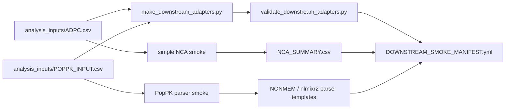

# Downstream E2E Smoke Checks

この文書は、`analysis_inputs/` から NCA / PopPK 側へ最低限つながるかを確認するための smoke check を説明します。

これは **Phoenix, NONMEM, nlmixr2 の正式検証ではありません**。目的は、fixture CSVが下流parser、簡易NCA計算、PopPK control/template作成まで破綻しないことを早く確認することです。

## Command

```bash
python3 tools/run_downstream_smoke.py \
  --analysis-dir outputs/<run>/workflow/analysis_inputs \
  --out-dir outputs/<run>/workflow/downstream_smoke
```

`make harness-check` では、versioned examplesに対してこのsmoke checkを実行します。

```bash
make downstream-check
```

## What It Does



## Outputs

| Output | Meaning |
| --- | --- |
| `adapters/` | R NCA / Phoenix-like / NONMEM-like / nlmixr2-like adapter CSVs |
| `nca_smoke/NCA_SUMMARY.csv` | simple linear-trapezoidal `CMAX`, `TMAX_H`, `AUCLAST` summary |
| `poppk_smoke/POPPK_PARSE_SUMMARY.yml` | dose/observation row counts and parser readiness checks |
| `poppk_smoke/nonmem_parser_template.ctl` | NONMEM parser smoke control template |
| `poppk_smoke/nlmixr2_parser_template.R` | nlmixr2 parser smoke model template |
| `DOWNSTREAM_SMOKE_MANIFEST.yml` | status, counts, warnings, limitations |

## Interpretation

| Status | Meaning |
| --- | --- |
| `OK` | Adapter CSVs have expected columns and simple NCA/PopPK parser smoke checks pass |
| `WARN` | Outputs were generated but some rows or summaries need review |
| `FAILED` | Adapter contract or required parser-ready structure is broken |

## Boundary

This check improves workflow confidence, but it does not replace:

- Phoenix project validation
- NONMEM execution
- nlmixr2 estimation
- model-specific dataset requirements
- clinical pharmacology validation

For formal tool use, treat the generated files as **starting fixtures** and add tool/project-specific control files, metadata, and validation outside this harness.
