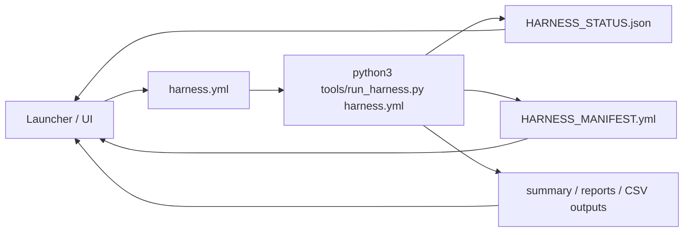

# Launcher Contract

この文書は、Shiny Cloud、Tauri、CLIなどの薄いUIからハーネスを呼ぶための契約です。

## Principle

UIはハーネスの中身を再実装しません。UIは設定ファイルを選び、`run_harness.py` を実行し、生成されたmanifest/status/CSVを表示します。



## Command

標準入口:

```bash
python3 tools/run_harness.py harness_examples/demo_set.yml
```

UIから呼ぶ場合も同じです。UI側で `run_demo_set.py` や `run_workflow.py` の細かい引数を直接組み立てないでください。

## Inputs

`run_harness.py` はYAML configを1つ受け取ります。

### `demo_set`

```yaml
version: "0.1"
mode: demo_set
drugs_dir: drugs
out_dir: outputs/demo_set_config
drugs:
  - albuterol
  - alprazolam
simulation:
  engine: analytical_demo
sampling:
  times_h: [0, 0.5, 1, 2, 4, 8, 12, 24]
validation:
  allow_failed: true
```

### `post_simulation`

```yaml
version: "0.1"
mode: post_simulation
out_dir: outputs/<run>/workflow
inputs:
  sim_full_csv: outputs/<run>/raw/sim_full.csv
  drug: aciclovir
  drugs_dir: drugs
sampling:
  times_h: [0, 0.5, 1, 2, 4, 8, 12, 24]
validation:
  allow_failed: false
```

既存SDTM-like skeletonを使う場合は `existing_domains` を追加します。

```yaml
existing_domains:
  dm_csv: existing/DM.csv
  vs_csv: existing/VS.csv
  lb_csv: existing/LB.csv
  pc_csv: existing/PC_skeleton.csv
```

## Outputs

全モードで、出力ディレクトリ直下に次を作ります。

```text
HARNESS_MANIFEST.yml
HARNESS_STATUS.json
```

UIはまず `HARNESS_STATUS.json` を読んでください。

例:

```json
{
  "schema": "pk_fixture_harness_status_v0.1",
  "mode": "demo_set",
  "status": "WARN",
  "out_dir": "outputs/demo_set_config",
  "warnings_n": 3,
  "outputs": {
    "summary_csv": "outputs/demo_set_config/summary.csv",
    "summary_md": "outputs/demo_set_config/summary.md"
  },
  "counts": {
    "drugs": 5,
    "ok_workflows": 2,
    "warn_workflows": 3,
    "failed_workflows": 0
  }
}
```

ADPC-like出力から記述統計レポートを追加したい場合、UIはR/ggplot処理を再実装せず、次のスクリプトを明示実行するか、生成済みartifactを表示してください。

```bash
Rscript tools/report_pk_fixture.R \
  --analysis-dir outputs/<run>/workflow/analysis_inputs \
  --out-dir outputs/<run>/workflow/reports/pk_fixture_report \
  --title "<slug> PK fixture report"
```

表示対象は `REPORT.md`, `subject_*_summary.csv`, `concentration_summary.csv`, `concentration_profile_linear.png`, `concentration_profile_log.png`, `REPORT_MANIFEST.yml` です。これはfixture確認用の記述統計で、validation reportやsubmission-ready ADaM reportとして扱わないでください。

Word共有用docxが必要な場合も、UI側でdocx生成を再実装せず、Quarto wrapperを呼んでください。

```bash
Rscript tools/render_pk_fixture_quarto.R \
  --analysis-dir outputs/<run>/workflow/analysis_inputs \
  --out-dir outputs/<run>/workflow/reports/pk_fixture_quarto \
  --title "<slug> PK fixture report"
```

UIが表示するのは `pk_fixture_report.docx`, `pk_fixture_report.qmd`, `QUARTO_REPORT_MANIFEST.yml` です。Wordの見た目を合わせる場合は、UIまたはconfigから `--reference-doc` 相当のパスを渡すだけにしてください。

## Status Rules

| Status | UI handling |
| --- | --- |
| `OK` | 通常表示。CSV preview/downloadを許可 |
| `WARN` | 警告を目立つ形で表示。CSV preview/downloadは許可 |
| `FAILED` | 失敗理由を表示。下流投入用downloadは慎重に扱う |

`WARN` や `FAILED` は臨床的な正誤判定ではありません。workflow fixtureとしての状態です。

## Exit Codes

| Case | Exit code |
| --- | --- |
| `OK` | `0` |
| `WARN` | `0` |
| `FAILED` | `1` |
| Config/IO/runtime error | `1` |

UIは終了コードだけでなく、可能なら `HARNESS_STATUS.json` と `HARNESS_MANIFEST.yml` を確認してください。

## UI Must Not Do

UI/launcherは次を行いません。

- `pk.yml`, `targets.yml`, `spec_pk1_*.yml` の直接編集
- validation WARN/FAILEDに基づくPK値の自動修正
- calibration artifactのcanonical PKへの自動反映
- mrgsolve runnerの代替として `analytical_demo` を説明すること
- generated outputをclinical validationやsubmission-ready SDTM/ADaMとして表示すること
- 記述統計レポートをVPC/GOFや臨床薬理モデル妥当化として表示すること

## Cloud Notes

Shiny Cloud / Posit Connect Cloudで使う場合:

- `run_harness.py` を起点にする
- mrgsolveをクラウド側で動かす場合は、別途小さいPoCで依存解決を確認する
- `analytical_demo` はsmoke demo専用と明示する
- 入力データの機密性、保存場所、削除ルールを別途決める

Tauriで使う場合:

- Python runtimeまたはbundled executableから `run_harness.py` を呼ぶ
- 画面は `HARNESS_STATUS.json`, `summary.md`, `MANIFEST.yml`, CSV previewに限定する
- ローカルWindowsでmrgsolve/Rtoolsを必須にしない

## Acceptance

launcher連携の最小到達条件:

```text
[x] UIから呼ぶコマンドが1つに固定されている
[x] 入力config例がある
[x] UIが読むJSON statusがある
[x] manifest/trace/report/CSVへの導線がある
[x] UIがやってはいけないことが明文化されている
```
