# PK Fixture Harness Process Flow

このページは、ハーネスの処理プロセスを説明するための図表ガイドです。

draw.io / diagrams.net で編集できる図は次のファイルです。

```text
docs/assets/pk-harness-process.drawio
docs/assets/pk-fixture-end-to-end-workflow.drawio
```

`pk-harness-process.drawio` は処理詳細、`pk-fixture-end-to-end-workflow.drawio` はCLI/PowerShell入口、下流検証、release/feedbackまで含めた全体像です。

## 図の読み方

このハーネスは、`sim_full.csv` を起点にして、下流ワークフロー検証用の synthetic fixture を作ります。

```mermaid
flowchart LR
    A["harness.yml / CLI args"] --> B["run_harness.py"]
    C["drugs/<slug>/ pk.yml / targets.yml / spec"] --> D["external runner or analytical demo"]
    B --> E["run_demo_set.py"]
    D --> F["raw/sim_full.csv"]
    E --> F
    B --> G["run_workflow.py"]
    F --> G
    G --> H["validate_simulation.py"]
    H --> I["simulation_validation.md"]
    H --> J["sample_clinical_timepoints.py<br/>exact / nearest / linear / log-linear<br/>optional predose MDV=1"]
    J --> K["clinical_samples.csv"]
    J --> L["make_sdtm_like_domains.py<br/>generate domains or fill existing skeletons<br/>optional BLQ PC flags"]
    L --> M["DM / VS / LB / EX / PC<br/>SDTM-like, not submission-ready"]
    M --> N["make_analysis_inputs.py<br/>CMT/RATE + BLQ/CENS/LIMIT"]
    N --> O["ADPC / NCA_INPUT / POPPK_INPUT"]
    O --> A1["make_downstream_adapters.py"]
    A1 --> A2["NCA / PopPK adapter CSVs<br/>NONMEM / nlmixr2 / Phoenix-facing"]
    O --> T["run_downstream_smoke.py"]
    T --> U["NCA_SUMMARY / PopPK parser templates"]
    O --> P["report_pk_fixture.R"]
    P --> Q["Markdown / summary CSV / ggplot PNG"]
    Q --> R["render_pk_fixture_quarto.R"]
    R --> S["Quarto DOCX"]
    I --> V["render_manifest_viewer.py"]
    V --> W["static HTML manifest viewer"]
```



## 重要な境界

| Area | Role |
| --- | --- |
| `run_harness.py` | YAML config からデモまたはpost-simulation workflowを起動する共通入口 |
| `run_workflow.py` | `sim_full.csv` 後の validate、採血点抽出、SDTM-like生成、analysis input生成 |
| `run_downstream_smoke.py` | ADPC/NCA/PopPK入力からadapter生成、簡易NCA、PopPK parser template作成まで確認 |
| `report_pk_fixture.R` | ADPC-likeから被験者背景、濃度統計、ggplotを含む記述統計レポートを作成 |
| `render_pk_fixture_quarto.R` | Word共有用の任意DOCXをQuartoで作成 |
| `render_manifest_viewer.py` | manifest/status確認用の静的HTML viewerを作成 |
| `MANIFEST.yml` / `trace.log` | 入力、出力、警告、処理順序の監査用artifact |

## Guardrails

- `run_workflow.py` は `pk.yml`, `targets.yml`, `spec_pk1_*.yml` を更新しません。
- `validate_simulation.py` は `OK/WARN/FAILED` を出すだけで、自動最適化しません。
- 文献値更新は `harvest_and_generate.py` とreview経路に限定します。
- calibration結果やデモ補正値は canonical `pk.yml` に混ぜません。
- 生成物は workflow fixture であり、臨床薬理モデル妥当化や submission-ready SDTM/ADaM ではありません。
