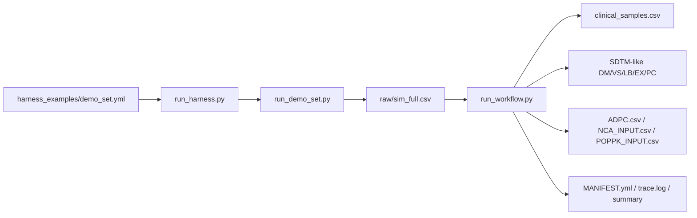

# Quickstart: PK-like Dummy Data Harness

このQuickstartは、初めてこのリポジトリを触る人が **複数薬剤デモを実行し、SDTM-like -> ADPC/NCA/PopPK入力まで確認する** ための最短手順です。

このハーネスは臨床推論や投与設計のためのものではありません。目的は、SDTM -> ADaM -> NCA / PopPK workflowを開発・検証するための実データ風dummy fixtureを作ることです。

## 1. What You Will Run



`run_demo_set.py` は外部mrgsolve runnerがない環境でも複数薬剤デモを確認するためのツールです。既存specのthetaからデモ専用の解析式 `sim_full.csv` を作ります。mrgsolve runnerの代替ではありません。

`run_harness.py` は設定ファイルから既存ツールを呼び出す共通入口です。Shiny Cloud、Tauri、CLIのどれからでも同じconfigを使えるようにするための薄いdispatcherです。

`tools/pk_fixture_cli.py` は正式なstandalone CLI入口です。リポジトリのルートから `python3 -m tools.pk_fixture_cli ...` として実行します（checkout前提のため専用のconsole scriptは提供していません）。

UI/launcherから呼ぶ場合の契約は [LAUNCHER_CONTRACT.md](LAUNCHER_CONTRACT.md) を参照してください。

説明資料用のdraw.io図は [assets/pk-harness-process.drawio](assets/pk-harness-process.drawio) にあります。図の読み方は [PROCESS_FLOW.md](PROCESS_FLOW.md) を参照してください。

成果物の形だけ先に確認したい場合は、Git管理された最小例 [../examples/minimal_aciclovir](../examples/minimal_aciclovir) と [../examples/minimal_albuterol_iv](../examples/minimal_albuterol_iv) を見てください。

## 2. Install And Check

リポジトリ直下で実行します。

```bash
python3 -m pip install -r requirements.txt
make validate
```

`make validate` がOKなら、薬剤テンプレート、必須ファイル、基本的なハーネス構造は読めています。

環境依存の確認を先に行う場合:

```bash
make doctor
python3 -m tools.pk_fixture_cli doctor
```

Git管理された最小exampleの再生成チェック:

```bash
make examples-check
```

READMEだけで第三者が動かせるかまでまとめて確認する場合:

```bash
make acceptance-check
```

configだけを確認する場合:

```bash
python3 tools/validate_harness_config.py harness_examples/demo_set.yml
```

## 3. Run Multi-drug Demo

OK例、WARN例、限界例が混ざる標準デモセットです。

```bash
python3 tools/run_harness.py harness_examples/demo_set.yml
```

CLI入口から実行する場合:

```bash
python3 -m tools.pk_fixture_cli run harness_examples/demo_set.yml
```

主な出力:

```text
outputs/demo_set_config/
  HARNESS_MANIFEST.yml
  HARNESS_STATUS.json
  DEMO_MANIFEST.yml
  summary.csv
  summary.md
  albuterol/
    raw/sim_full.csv
    workflow/
      MANIFEST.yml
      reports/simulation_validation.md
      raw/clinical_samples.csv
      sdtm_like/
        DM.csv
        VS.csv
        LB.csv
        EX.csv
        PC.csv
      analysis_inputs/
        ADPC.csv
        NCA_INPUT.csv
        POPPK_INPUT.csv
        MANIFEST.yml
```

## 4. Read The Summary

```bash
cat outputs/demo_set_config/summary.md
```

見るポイント:

| Column | Meaning |
| --- | --- |
| `Workflow` | 後処理全体のステータス |
| `Validation` | AUC/t1/2などのPK sanity check |
| `ADPC rows` | ADPC-like出力行数 |
| `NCA rows` | NCA入力行数 |
| `PopPK rows` | NONMEM-like入力行数 |
| `Warnings` | 文献targetやspec thetaとのズレなど |

`WARN` や `FAILED` は、workflow fixtureでは必ずしも悪ではありません。処理系が境界条件を扱えるかを見る材料になります。ただし、臨床的に正しい再現とは説明しないでください。

## 5. Check Downstream Inputs

薬剤ごとに `analysis_inputs` を確認します。

```bash
head outputs/demo_set_config/albuterol/workflow/analysis_inputs/ADPC.csv
head outputs/demo_set_config/albuterol/workflow/analysis_inputs/NCA_INPUT.csv
head outputs/demo_set_config/albuterol/workflow/analysis_inputs/POPPK_INPUT.csv
cat outputs/demo_set_config/albuterol/workflow/analysis_inputs/MANIFEST.yml
```

| File | Intended use | Limitation |
| --- | --- | --- |
| `ADPC.csv` | ADPC-like parser / ADaM workflow smoke test | submission-ready ADaMではない |
| `NCA_INPUT.csv` | NCA pipeline smoke test | NCAツール固有列はadapterで調整する |
| `POPPK_INPUT.csv` | NONMEM-like parser / control stream smoke test | モデル固有datasetではない |
| `MANIFEST.yml` | 入力対応、件数、警告確認 | 警告があれば下流投入前に読む |

## 6. Generate A Descriptive Report

ADPC-like出力から、被験者背景の要約統計、時点別の濃度統計、ggplot2の濃度推移図を作れます。

```bash
Rscript tools/report_pk_fixture.R \
  --analysis-dir outputs/demo_set_config/albuterol/workflow/analysis_inputs \
  --out-dir outputs/demo_set_config/albuterol/workflow/reports/pk_fixture_report \
  --title "albuterol PK fixture report"
```

主な出力:

| File | Content |
| --- | --- |
| `REPORT.md` | 被験者背景、濃度統計、linear/log plotをまとめたMarkdown |
| `subject_numeric_summary.csv` | 年齢、体重、身長、BMI、BSA、クレアチニンなど |
| `subject_categorical_summary.csv` | 性別、arm、routeなど |
| `concentration_summary.csv` | `TIME_H` ごとの n/mean/SD/CV/geometric mean/median |
| `concentration_profile_linear.png` | そのままの濃度スケールのggplot |
| `concentration_profile_log.png` | log10濃度スケールのggplot。非陽性濃度はlog plotから除外 |

これはfixture確認用の記述統計レポートです。臨床薬理モデルの妥当性確認やsubmission-ready ADaM reportではありません。

Word共有用のdocxが必要な場合は、同じ入力からQuarto版を作成します。

```bash
Rscript tools/render_pk_fixture_quarto.R \
  --analysis-dir outputs/demo_set_config/albuterol/workflow/analysis_inputs \
  --out-dir outputs/demo_set_config/albuterol/workflow/reports/pk_fixture_quarto \
  --title "albuterol PK fixture report"
```

出力は `pk_fixture_report.qmd`, `pk_fixture_report.docx`, `QUARTO_REPORT_MANIFEST.yml` です。Wordスタイルを合わせたい場合は、任意で `--reference-doc reference.docx` を指定します。
同梱のたたき台は `templates/pk_fixture_reference.docx` です。

## 7. Generate Tool-specific Adapter CSVs

ADPC/NCA/PopPK入力から、NCA/PopPKツール別の軽量adapter CSVを作れます。

```bash
python3 tools/make_downstream_adapters.py \
  --analysis-dir outputs/demo_set_config/albuterol/workflow/analysis_inputs \
  --out-dir outputs/demo_set_config/albuterol/workflow/adapters
```

出力:

| File | Intended use |
| --- | --- |
| `nca_r.csv` | R系NCA parser smoke test |
| `nca_phoenix.csv` | Phoenix風NCA取り込み確認 |
| `poppk_nonmem.csv` | NONMEM風control-stream parser確認 |
| `poppk_nlmixr2.csv` | nlmixr2風parser確認 |

これは列名adapterであり、各ツールの正式な解析仕様を保証するものではありません。

施設ごとのCSV列名や必須列に合わせたい場合:

```bash
python3 tools/make_site_adapters.py \
  --analysis-dir outputs/demo_set_config/albuterol/workflow/analysis_inputs \
  --spec-yml external_validation/site_adapter_template.yml \
  --out-dir outputs/demo_set_config/albuterol/workflow/site_adapters
```

`external_validation/site_adapter_template.yml` をコピーして、施設のNCA/PopPK dataset仕様に合わせて編集します。

adapter生成、簡易NCA、PopPK parser template作成まで一括で確認する場合:

```bash
python3 tools/run_downstream_smoke.py \
  --analysis-dir outputs/demo_set_config/albuterol/workflow/analysis_inputs \
  --out-dir outputs/demo_set_config/albuterol/workflow/downstream_smoke
```

この結果は `DOWNSTREAM_SMOKE_MANIFEST.yml` に残ります。正式なPhoenix/NONMEM/nlmixr2検証ではなく、下流接続用のE2E smoke checkです。

## 8. Two Input Patterns

このハーネスは2パターンで使えます。

| Pattern | Command path | What happens |
| --- | --- | --- |
| 既存DM/LB/VS/PCなし | `sim_full.csv` -> `run_workflow.py` | `clinical_samples.csv`, SDTM-like, analysis inputsを生成 |
| 既存DM/LB/VS/PC skeletonあり | `run_workflow.py --dm-csv --vs-csv --lb-csv --pc-csv` | 既存DM/VS/LBを保持し、PC skeletonに濃度を注入 |

既存skeletonを使う例:

```bash
python3 tools/run_workflow.py \
  --sim-full outputs/<run>/raw/sim_full.csv \
  --drug <slug> \
  --times 0,0.5,1,2,4,8,12,24 \
  --dm-csv existing/DM.csv \
  --vs-csv existing/VS.csv \
  --lb-csv existing/LB.csv \
  --pc-csv existing/PC_skeleton.csv \
  --out-dir outputs/<run>/workflow
```

`PC` skeletonは `USUBJID + PCTPTNUM` を優先して照合します。次に `USUBJID + PCTPT`、最後に `USUBJID + PCELTM/TIME` を使います。
既存skeletonは実行前に最低限の列チェックを受けます。`DM` は `USUBJID`、`VS` は `USUBJID/VSTESTCD/VSSTRESN`、`LB` は `USUBJID/LBTESTCD/LBSTRESN`、`PC` は `USUBJID` と時点照合列が必要です。

## 9. External Runner Pattern

実運用に近いシミュレーションでは、利用環境側のmrgsolve runnerで `sim_full.csv` を作ってから、後処理だけをこのハーネスで行います。

```bash
Rscript <mrgsolve-runner> drugs/<slug>/spec_pk1_oral.yml

python3 tools/run_workflow.py \
  --sim-full outputs/<run>/raw/sim_full.csv \
  --drug <slug> \
  --times 0,0.5,1,2,4,8,12,24 \
  --out-dir outputs/<run>/workflow
```

## 10. What To Show Reviewers

臨床薬理、統計、プログラマーに共有する場合は、次をセットで見せるのが安全です。

```text
drugs/<slug>/pk.yml
drugs/<slug>/targets.yml
drugs/<slug>/spec_pk1_*.yml
outputs/<run>/workflow/reports/simulation_validation.md
outputs/<run>/workflow/reports/pk_fixture_report/REPORT.md
outputs/<run>/workflow/reports/pk_fixture_quarto/pk_fixture_report.docx
outputs/<run>/workflow/MANIFEST.yml
outputs/<run>/workflow/trace.log
outputs/<run>/workflow/sdtm_like/MANIFEST.yml
outputs/<run>/workflow/analysis_inputs/MANIFEST.yml
```

複数薬剤デモでは、まず `outputs/demo_set_config/summary.md` を見せると全体像が伝わります。

## 11. Completion Checklist

```text
[ ] make validate がOK
[ ] 必要なら make doctor で環境差を確認
[ ] make examples-check でversioned exampleの出力形式を確認
[ ] run_harness.py が完走
[ ] summary.md で OK/WARN/FAILED の意味を確認
[ ] 少なくとも1薬剤で ADPC/NCA/PopPK入力を確認
[ ] 必要なら report_pk_fixture.R で記述統計レポートを作成
[ ] Word共有が必要なら render_pk_fixture_quarto.R でdocxを作成
[ ] 必要なら make_downstream_adapters.py でtool別adapter CSVを作成
[ ] 必要なら run_downstream_smoke.py で下流E2E smoke checkを実行
[ ] 必要なら validate_manifest.py でMANIFEST.yml構造を確認
[ ] MANIFEST.yml と trace.log が残っている
[ ] pk.yml は自動更新していない
```

より詳しい説明は [USER_GUIDE.md](USER_GUIDE.md) を参照してください。
