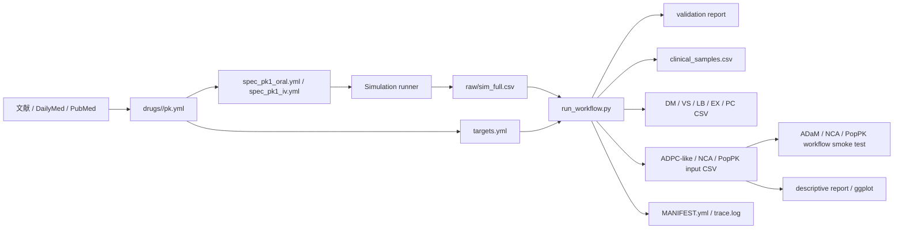
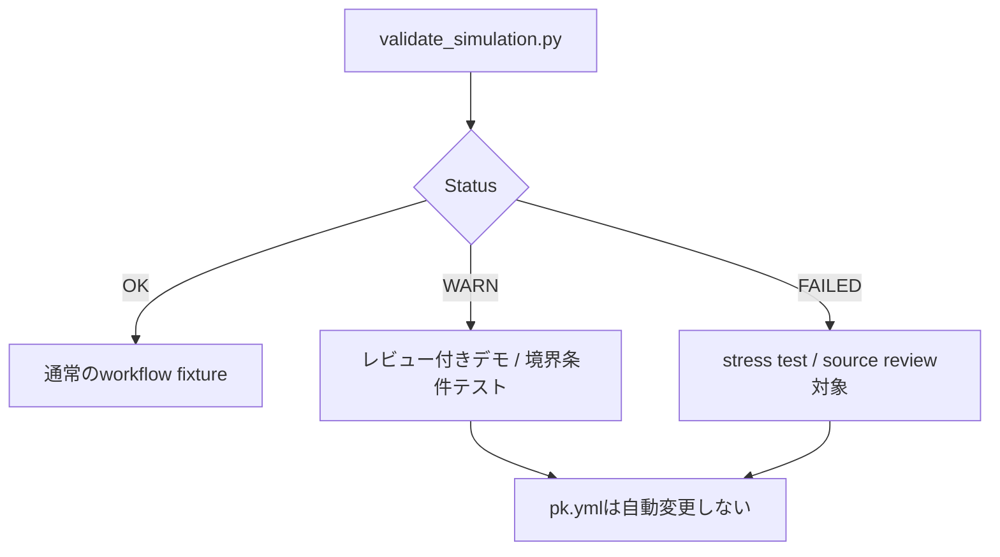
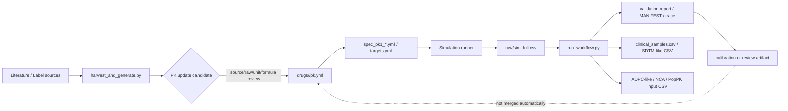

# PK-like Synthetic Data Harness 使用マニュアル

このマニュアルは、このリポジトリを **SDTM -> ADaM -> NCA / PopPK ワークフロー検証用のダミーデータ生成ハーネス** として使うための手順書です。

このハーネスは臨床推論や投与設計のためのモデルではありません。文献スケールの CL/V/t1/2/AUC を使い、実データに近い形の synthetic PK data を作って、解析処理を素早く回すことを目的にしています。

初めて実行する場合は、まず [QUICKSTART.md](QUICKSTART.md) の複数薬剤デモを試してください。このUSER_GUIDEは、Quickstart後に個別ツールや既存SDTM-like skeleton利用を詳しく確認するための詳細版です。

## 1. 全体像



このリポジトリが直接管理するものは、薬剤テンプレート、検証ツール、文献パラメータ更新ツール、手順書です。mrgsolveなどの実行runnerは、利用環境側のスクリプトに合わせて使います。

## 2. まず確認する

リポジトリ直下で実行します。

```bash
python3 -m pip install -r requirements.txt
make harness-check
```

成功すると、ライブラリ整合性、単体テスト、INDEX再現性、不要ファイル混入のチェックが通ります。

個別に見る場合:

```bash
make validate
make test
make regen-check
```

## 3. 薬剤を選ぶ

薬剤一覧は `INDEX.csv` です。

```bash
column -s, -t < INDEX.csv | less -S
```

各薬剤ディレクトリは次の構造です。

```text
drugs/<slug>/
  pk.yml              # source/raw/parsed/derived PK summary
  targets.yml         # AUC/t1/2 の最低限チェック用 target
  spec_pk1_oral.yml   # 経口薬の場合
  spec_pk1_iv.yml     # IV薬の場合
```

## 4. 標準ワークフロー

### Step 1: specを実行する

経口薬:

```bash
Rscript <mrgsolve-runner> drugs/<slug>/spec_pk1_oral.yml
```

IV薬:

```bash
Rscript <mrgsolve-runner> drugs/<slug>/spec_pk1_iv.yml
```

`<mrgsolve-runner>` には、利用環境で使っているmrgsolve runnerを指定してください。このリポジトリのspecは、runnerに `spec_pk1_*.yml` を渡す前提の入力テンプレートです。

典型的な出力:

```text
outputs/<run>/
  raw/sim_full.csv
  nonmem/*.csv
  reports/*.md
```

### Step 2: シミュレーション出力を検証する

一括で回す場合は、`run_workflow.py` を使います。これは `sim_full.csv` 生成後の validate、採血時点抽出、SDTM-like CSV生成、run-level manifest/trace作成をまとめて行います。

```bash
python3 tools/run_workflow.py \
  --sim-full outputs/<run>/raw/sim_full.csv \
  --drug <slug> \
  --times 0,0.5,1,2,4,8,12,24 \
  --out-dir outputs/<run>/workflow
```

`validate_simulation.py` が `FAILED` の場合、既定では下流の `clinical_samples.csv` / SDTM-like CSV生成に進みません。stress testとして進めたい場合だけ `--allow-validation-failed` を付けてください。

個別に検証だけ行う場合:

```bash
python3 tools/validate_simulation.py \
  outputs/<run>/raw/sim_full.csv \
  --pk drugs/<slug>/pk.yml \
  --targets drugs/<slug>/targets.yml \
  --out-md outputs/<run>/reports/simulation_validation.md
```

この検証は `sim_full.csv` から `AUC0-inf`, `Cmax`, `Tmax`, terminal `t1/2` を再計算します。現時点で主に判定に使うのは AUC と t1/2 です。

### Step 3: 臨床試験の採血ポイントに合わせる

密な `sim_full.csv` を、名目採血時点だけの疎なデータにします。

```bash
python3 tools/sample_clinical_timepoints.py \
  outputs/<run>/raw/sim_full.csv \
  --times 0,0.5,1,2,4,8,12,24 \
  --out outputs/<run>/raw/clinical_samples.csv
```

出力には元の列に加えて、次の列が追加されます。

| Column | Meaning |
| --- | --- |
| `NOMTIME_H` | 名目採血時刻 |
| `TIME_H` | 実採血時刻 |
| `TPT` | 採血時点名 |
| `TPTNUM` | 採血時点番号 |
| `SAMPLE_METHOD` | `linear`, `exact`, `nearest` |

### Step 4: SDTM/ADaM/NCA/PopPKへ投入する

下流処理には通常、`raw/sim_full.csv` よりも `clinical_samples.csv` の方が扱いやすいです。SDTM PC/PP、ADPC、NCA、PopPK用データセットに変換する入口として使います。

`run_workflow.py` は、限定版SDTM-like CSVに加えて `analysis_inputs/` も作ります。ここには ADPC-like、NCA、PopPK parser/control-stream smoke test 用のCSVが入ります。

## 5. 採血スケジュールをCSVで指定する

既存試験の採血時点名に合わせたい場合は、schedule CSVを作ります。

```csv
NOMTIME_H,TPT,TPTNUM
0,Pre-dose,1
0.5,30 min,2
1,1 h,3
2,2 h,4
4,4 h,5
8,8 h,6
12,12 h,7
24,24 h,8
```

実行:

```bash
python3 tools/sample_clinical_timepoints.py \
  outputs/<run>/raw/sim_full.csv \
  --schedule-csv schedule.csv \
  --out outputs/<run>/raw/clinical_samples.csv
```

実採血時刻らしさを入れる場合:

```bash
python3 tools/sample_clinical_timepoints.py \
  outputs/<run>/raw/sim_full.csv \
  --schedule-csv schedule.csv \
  --jitter-min 5 \
  --seed 20260217 \
  --out outputs/<run>/raw/clinical_samples.csv
```

`--jitter-min 5` は、名目時刻の前後5分以内で `TIME_H` を揺らします。Pre-doseの0時間は0のままです。

## 6. 採血ポイント抽出方法の選び方

| Method | Use case |
| --- | --- |
| `linear` | 推奨。密な時系列から名目時刻へ線形補間する |
| `exact` | `sim_full.csv` にその時刻が必ず存在する場合 |
| `nearest` | 補間せず、近い時刻の行を使いたい場合 |

例:

```bash
python3 tools/sample_clinical_timepoints.py \
  outputs/<run>/raw/sim_full.csv \
  --times 0,1,2,4 \
  --method nearest \
  --nearest-window-h 0.25 \
  --out outputs/<run>/raw/clinical_samples.csv
```

## 7. 結果の扱い



| Status | Recommended handling |
| --- | --- |
| `OK` | 標準的なダミーデータとして使う |
| `WARN` | 難しめのケースとして使う。レポートを残す |
| `FAILED` | stress test、または文献/source/model review対象として扱う |

`WARN` や `FAILED` は、ワークフロー検証では必ずしも悪ではありません。実データ処理では扱いにくいデータも出るため、処理系を鍛える目的では有用です。ただし、臨床的に正しい再現とは説明しないでください。

## 8. SDTM-likeドメインCSVを作る場合

`clinical_samples.csv` から、ワークフロー検証用の限定版 `DM`, `VS`, `LB`, `EX`, `PC` を作れます。

```bash
python3 tools/make_sdtm_like_domains.py \
  --clinical-samples outputs/<run>/raw/clinical_samples.csv \
  --spec drugs/<slug>/spec_pk1_oral.yml \
  --out-dir outputs/<run>/sdtm_like
```

出力:

| File | Scope |
| --- | --- |
| `DM.csv` | 被験者ID、年齢、性別、arm |
| `VS.csv` | `HEIGHT`, `WEIGHT`, `BMI`, `BSA` のみ |
| `LB.csv` | `CREAT` のみ |
| `EX.csv` | spec/subject由来の投与情報 |
| `PC.csv` | `clinical_samples.csv` 由来の濃度時点 |
| `MANIFEST.yml` | 入力ファイル、設定、件数、警告 |

これは submission-ready SDTM/XPT ではありません。SDTM -> ADaM -> NCA / PopPK の処理系を早く回すためのCSV fixtureです。

`--subjects-csv` を使う場合、subjects側とPC側の被験者ID不一致は警告として `MANIFEST.yml` と標準出力に残ります。厳密に止めたい場合は `--strict-subject-match` を追加します。

PC濃度は既定で `DV` を読み、必要に応じて `CP`, `IPRED` をフォールバックします。全行で濃度が読めない場合はエラー、部分的に読めない場合は警告になります。

### 既存DM/LB/VS/PC skeletonがある場合

既存の `DM`, `VS`, `LB` を保持し、濃度なし `PC` skeletonだけにシミュレーション濃度を注入できます。

```bash
python3 tools/run_workflow.py \
  --sim-full outputs/<run>/raw/sim_full.csv \
  --drug <slug> \
  --times 0,0.5,1,2,4,8,12,24 \
  --dm-csv existing/DM.csv \
  --vs-csv existing/VS.csv \
  --lb-csv existing/LB.csv \
  --pc-csv existing/PC_skeleton.csv \
  --out-dir outputs/<run>/workflow
```

`PC` skeletonは `USUBJID + PCTPTNUM` を優先して照合し、次に `USUBJID + PCTPT`、最後に `USUBJID + PCELTM/TIME` を使います。非空欄の既存濃度は上書きしません。上書きしたい場合だけ `--overwrite-existing-pc-conc` を使います。

## 9. ADPC/NCA/PopPK入力を作る場合

`run_workflow.py` を使うと、SDTM-like生成後に自動で次のファイルが作られます。

```text
outputs/<run>/workflow/analysis_inputs/
  ADPC.csv
  NCA_INPUT.csv
  POPPK_INPUT.csv
  MANIFEST.yml
```

| File | Intended use | Important limitation |
| --- | --- | --- |
| `ADPC.csv` | ADPC-likeな濃度解析入力 | submission-ready ADaMではない |
| `NCA_INPUT.csv` | NCA pipeline smoke test | 実NCAツールの列仕様には必要に応じてadapterを足す |
| `POPPK_INPUT.csv` | NONMEM-like parser/control-stream smoke test | モデル固有のcontrol streamを保証しない |
| `MANIFEST.yml` | 件数、警告、入力対応の確認 | 警告がある場合は下流投入前に確認する |

個別にSDTM-likeディレクトリから作る場合:

```bash
python3 tools/make_analysis_inputs.py \
  --sdtm-like-dir outputs/<run>/workflow/sdtm_like \
  --out-dir outputs/<run>/workflow/analysis_inputs
```

このステップの役割は、臨床薬理的な正しさの証明ではなく、**SDTM-likeからADaM/NCA/PopPK側へ最低限つながるか** の確認です。PC濃度が全て欠損している場合は停止し、部分欠損は `MANIFEST.yml` の警告とPopPK側の `MDV=1` として残します。

### 記述統計レポートを作る場合

`analysis_inputs/ADPC.csv` から、被験者背景の要約統計、時点別濃度統計、ggplot2による濃度推移図を作れます。

```bash
Rscript tools/report_pk_fixture.R \
  --analysis-dir outputs/<run>/workflow/analysis_inputs \
  --out-dir outputs/<run>/workflow/reports/pk_fixture_report \
  --title "<slug> PK fixture report"
```

出力:

| File | Content |
| --- | --- |
| `REPORT.md` | Markdown形式の記述統計レポート |
| `subject_numeric_summary.csv` | `AGE`, `WT`, `HEIGHT_CM`, `BMI`, `BSA`, `CREAT_MG_DL`, `DOSE_MG` の要約 |
| `subject_categorical_summary.csv` | `SEX`, `ARM`, `ACTARM`, `ROUTE` の度数 |
| `concentration_summary.csv` | `TIME_H` ごとの n/mean/SD/CV/geometric mean/medianなど |
| `concentration_profile_linear.png` | そのままの濃度スケールのggplot |
| `concentration_profile_log.png` | log10濃度スケールのggplot。非陽性濃度は除外 |
| `REPORT_MANIFEST.yml` | 入力、出力、件数、安全策 |

このレポートはfixture確認用です。submission-ready ADaMレポート、VPC/GOF、臨床薬理モデル妥当化の代替ではありません。

Word共有用のdocxが必要な場合は、Quarto wrapperを使います。これは上記の軽量レポートを置き換えるものではなく、同じ内容をWordで配布しやすくする任意ステップです。

```bash
Rscript tools/render_pk_fixture_quarto.R \
  --analysis-dir outputs/<run>/workflow/analysis_inputs \
  --out-dir outputs/<run>/workflow/reports/pk_fixture_quarto \
  --title "<slug> PK fixture report"
```

出力:

| File | Content |
| --- | --- |
| `pk_fixture_report.qmd` | 生成済みMarkdown/PNGを埋め込んだQuarto source |
| `pk_fixture_report.docx` | Word共有用レポート |
| `QUARTO_REPORT_MANIFEST.yml` | Quarto template、入力、出力、render状態 |

Wordのスタイルを合わせたい場合は、任意で `--reference-doc reference.docx` を指定できます。Quartoの `reference-doc` は見た目のスタイル参照であり、統計ロジックは `.qmd` やCSV側で管理します。

## 10. 複数薬剤デモを作る場合

Milestone 7では、3-5薬剤程度をまとめて流し、成功例、WARN例、限界例を確認します。

```bash
python3 tools/run_harness.py harness_examples/demo_set.yml
```

出力:

```text
outputs/demo_set_milestone7/
  DEMO_MANIFEST.yml
  summary.csv
  summary.md
  <drug>/
    raw/sim_full.csv
    workflow/
      reports/simulation_validation.md
      raw/clinical_samples.csv
      sdtm_like/
      analysis_inputs/
```

`summary.csv` には、各薬剤の `workflow_status`, `validation_status`, `analysis_adpc_rows`, `analysis_nca_rows`, `analysis_poppk_rows`, `warnings_n` が入ります。

重要な注意点:

- `run_harness.py` はYAML configから既存ツールを呼ぶ共通入口です。Shiny CloudやTauriから呼ぶ場合も、この入口を使う想定です。
- `run_demo_set.py` はデモ専用の解析式generatorで `sim_full.csv` を作ります。
- 既存の `spec_pk1_*.yml` のthetaを読みますが、`pk.yml`, `targets.yml`, specは更新しません。
- mrgsolve runnerの代替ではありません。実運用に近いシミュレーションデモでは、外部runnerで作った `sim_full.csv` を `run_workflow.py` に渡してください。
- WARN/FAILEDは「臨床的に悪い」と同義ではなく、workflow fixtureとして扱うべき境界条件のラベルです。

## 11. アプリ化の判断

現時点では、Shinyなどのフルアプリ化は行わず、CLI + Quickstart + USER_GUIDEで運用する判断です。理由と将来UIを作る場合の範囲は [APP_DECISION.md](APP_DECISION.md) にまとめています。

作る場合も、最初は `run_harness.py` を呼び出して `summary`, `MANIFEST`, validation reportを表示する thin launcher / manifest viewer に限定します。`pk.yml` の直接編集やcalibration結果の自動反映はUIでも行いません。

UI/launcherが読むべき入出力契約は [LAUNCHER_CONTRACT.md](LAUNCHER_CONTRACT.md) にまとめています。UIは `HARNESS_STATUS.json` を読み、必要に応じて `HARNESS_MANIFEST.yml`, `summary.md`, validation report, CSVを表示します。

## 12. 被験者属性CSVを使う場合

任意で `simPop` を使って被験者属性CSVを作れます。

```bash
Rscript -e 'install.packages("simPop", repos="https://cloud.r-project.org")'
Rscript tools/make_simpop_subjects.R \
  --out subjects/subjects.csv \
  --n 100 \
  --dose-mg 100 \
  --seed 20260217

python3 tools/validate_subjects_csv.py subjects/subjects.csv \
  --expected-n 100 \
  --allowed-arm A
```

`simPop` は年齢、性別、体重などの属性生成に限定します。PK個人差、`CL`, `V`, `KA`, `ETA` の根拠にはしません。

`make_simpop_subjects.R` は任意列 `HEIGHT_CM` も出力します。`make_sdtm_like_domains.py` に `--subjects-csv` を渡すと、VSの身長、BMI、BSA作成に使われます。

```bash
python3 tools/make_sdtm_like_domains.py \
  --clinical-samples outputs/<run>/raw/clinical_samples.csv \
  --spec drugs/<slug>/spec_pk1_oral.yml \
  --subjects-csv subjects/subjects.csv \
  --out-dir outputs/<run>/sdtm_like
```

## 13. 文献情報からパラメータを更新する

文献情報を探してパラメータを更新する経路は残しています。詳細は [HARVEST.md](HARVEST.md) を参照してください。



| Component | Role | Guardrail |
| --- | --- | --- |
| `run_workflow.py` | 検証、採血点抽出、SDTM-like生成、ADPC-like/NCA/PopPK入力生成 | `pk.yml` は更新しない |
| `validate_simulation.py` | `OK/WARN/FAILED` を出す | WARN/FAILEDを理由に自動最適化しない |
| `harvest_and_generate.py` | 文献からPK更新候補を作る | source/raw/parsed/derivedの対応を残す |
| `pk.yml` | canonical PK summary | 根拠不明の推測値やcalibration値を混ぜない |
| calibration artifact | デモ・補正・review結果 | canonical `pk.yml` とは別管理 |

実行例:

```bash
uv run --with requests --with lxml --with pyyaml python tools/harvest_and_generate.py \
  --jobs jobs.yml \
  --repo . \
  --default-dose-mg 100

python tools/rebuild_index.py .
make harness-check
```

更新時のルール:

- source URL と raw text を残す
- `pk_raw`, `pk_parsed`, `derived` の関係を壊さない
- 単位変換と導出式を説明できるようにする
- 経口薬の CL/V は原則 CL/F, V/F として扱う
- calibration artifact を canonical な `pk.yml` に混ぜない

## 14. よく使うコマンド

| Purpose | Command |
| --- | --- |
| 全体チェック | `make harness-check` |
| 軽い整合性チェック | `make validate` |
| 単体テスト | `make test` |
| INDEX再現性確認 | `make regen-check` |
| config一括ハーネス | `python3 tools/run_harness.py harness_examples/demo_set.yml` |
| 一括workflow | `python3 tools/run_workflow.py --sim-full outputs/<run>/raw/sim_full.csv --drug <slug> --times 0,0.5,1,2,4,8,12,24 --out-dir outputs/<run>/workflow` |
| 複数薬剤デモ | `python3 tools/run_harness.py harness_examples/demo_set.yml` |
| 既存SDTM skeleton利用 | `python3 tools/run_workflow.py --sim-full outputs/<run>/raw/sim_full.csv --drug <slug> --times 0,0.5,1,2,4,8,12,24 --dm-csv existing/DM.csv --vs-csv existing/VS.csv --lb-csv existing/LB.csv --pc-csv existing/PC_skeleton.csv --out-dir outputs/<run>/workflow` |
| シミュレーション検証 | `python3 tools/validate_simulation.py outputs/<run>/raw/sim_full.csv --pk drugs/<slug>/pk.yml --targets drugs/<slug>/targets.yml --out-md outputs/<run>/reports/simulation_validation.md` |
| 採血時点抽出 | `python3 tools/sample_clinical_timepoints.py outputs/<run>/raw/sim_full.csv --times 0,0.5,1,2,4,8,12,24 --out outputs/<run>/raw/clinical_samples.csv` |
| SDTM-like CSV生成 | `python3 tools/make_sdtm_like_domains.py --clinical-samples outputs/<run>/raw/clinical_samples.csv --spec drugs/<slug>/spec_pk1_oral.yml --out-dir outputs/<run>/sdtm_like` |
| ADPC/NCA/PopPK入力生成 | `python3 tools/make_analysis_inputs.py --sdtm-like-dir outputs/<run>/workflow/sdtm_like --out-dir outputs/<run>/workflow/analysis_inputs` |
| 記述統計レポート生成 | `Rscript tools/report_pk_fixture.R --analysis-dir outputs/<run>/workflow/analysis_inputs --out-dir outputs/<run>/workflow/reports/pk_fixture_report --title "<slug> PK fixture report"` |
| Quarto docxレポート生成 | `Rscript tools/render_pk_fixture_quarto.R --analysis-dir outputs/<run>/workflow/analysis_inputs --out-dir outputs/<run>/workflow/reports/pk_fixture_quarto --title "<slug> PK fixture report"` |
| 被験者CSV検証 | `python3 tools/validate_subjects_csv.py subjects/subjects.csv --expected-n 100 --allowed-arm A` |

## 15. トラブルシューティング

| Symptom | Likely cause | Action |
| --- | --- | --- |
| `validate_simulation.py` が WARN | t1/2やAUCがtargetから少し外れている | workflow fixtureとして使うならレポートを残す |
| `validate_simulation.py` が FAILED | 1-compartment限界、CL/V basis、文献値不整合 | stress test扱い、またはsource review |
| `sample_clinical_timepoints.py` が範囲外エラー | 指定した採血時刻が `sim_full.csv` の時間範囲外 | `sampling.t_end_h` を延ばして再実行、または採血時刻を短くする |
| `--method exact` でエラー | 指定時刻がCSVに存在しない | `linear` か `nearest` を使う |
| `make_sdtm_like_domains.py` が濃度列を読めない | `clinical_samples.csv` に `DV` がない | `--pc-conc-col CP` など実列名を指定する |
| 既存PC skeletonに濃度が入らない | `USUBJID` と `PCTPTNUM/PCTPT/PCELTM` が合わない | skeleton側の時点キーを確認する |
| `make_analysis_inputs.py` が停止する | PC濃度が全て欠損している | `PCSTRESN`, `PCORRES`, `DV`, `CP`, `IPRED` のいずれかが入っているか確認する |
| `report_pk_fixture.R` が `ggplot2` 不足で停止する | R package未導入 | `install.packages("ggplot2")` を実行する。ハーネス本体はこのレポートなしでも実行可能 |
| `render_pk_fixture_quarto.R` がQuarto不足で停止する | Quarto CLI未導入または実行制約 | Quartoを導入する。docx不要なら `report_pk_fixture.R` のMarkdown/PNG/CSVで運用する |
| `run_demo_set.py` の結果がWARNになる | 既存spec thetaとtargets/pk.ymlのズレ、1-comp限界、デモ解析式とmrgsolve runner差 | `summary.md` と各薬剤の `simulation_validation.md` を確認する。canonical PK値は自動変更しない |
| subjectsとPCの被験者が合わない | `--subjects-csv` と `clinical_samples.csv` のID差 | `MANIFEST.yml` の警告を確認し、厳密に止めるなら `--strict-subject-match` を使う |
| `simPop` が動かない | R package未導入または環境依存 | `simPop` なしで既定のpopulation設定を使う |

## 16. 専門家に説明するときの表現

そのまま使える説明文:

> This harness generates literature-scale PK-like synthetic data for SDTM/ADaM/NCA/PopPK workflow testing. It is not intended for clinical inference, dose selection, or regulatory model qualification.

共有するとよいもの:

- `docs/USER_GUIDE.md`
- 対象薬剤の `drugs/<slug>/pk.yml`
- 対象薬剤の `targets.yml`
- 実行した `spec_pk1_*.yml`
- `outputs/<run>/reports/simulation_validation.md`
- 採血時点抽出後の `clinical_samples.csv`
- 必要に応じて `outputs/<run>/sdtm_like/*.csv`
- SDTM-like生成時の `outputs/<run>/sdtm_like/MANIFEST.yml`
- `outputs/<run>/workflow/analysis_inputs/*.csv`
- `outputs/<run>/workflow/analysis_inputs/MANIFEST.yml`
- 必要に応じて `outputs/<run>/workflow/reports/pk_fixture_report/REPORT.md`
- Word共有が必要なら `outputs/<run>/workflow/reports/pk_fixture_quarto/pk_fixture_report.docx`
- 複数薬剤デモでは `outputs/demo_set_milestone7/summary.csv` と `summary.md`
- アプリ化判断では `docs/APP_DECISION.md`
- UI/launcher連携では `docs/LAUNCHER_CONTRACT.md`

## 17. 最小チェックリスト

```text
[ ] INDEX.csv から薬剤を選ぶ
[ ] spec_pk1_*.yml をrunnerで実行する
[ ] raw/sim_full.csv が出ている
[ ] run_workflow.py で validation report / clinical_samples.csv / SDTM-like CSV / analysis_inputs / MANIFEST / trace.log を作る
[ ] OK/WARN/FAILED の扱いを記録する
[ ] ADPC.csv / NCA_INPUT.csv / POPPK_INPUT.csv を下流workflowに投入する
[ ] 必要なら report_pk_fixture.R で被験者背景と濃度の記述統計レポートを出す
[ ] Word共有が必要なら render_pk_fixture_quarto.R でdocxを出す
[ ] 複数薬剤デモでは summary.csv / summary.md で薬剤間の成功/WARN/限界例を確認する
```
